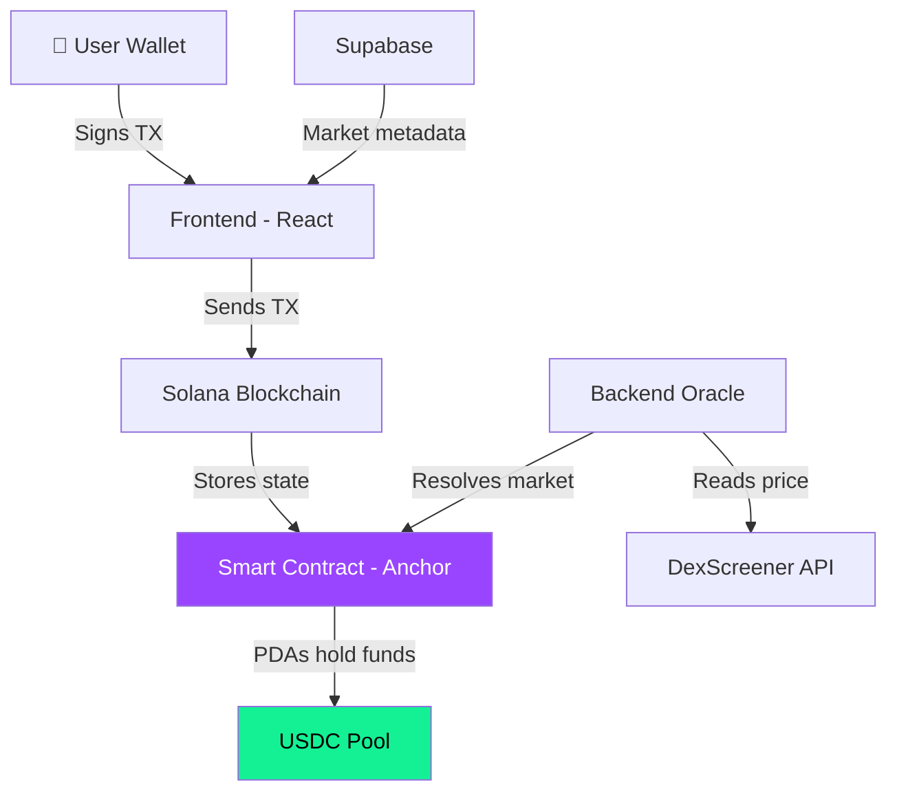
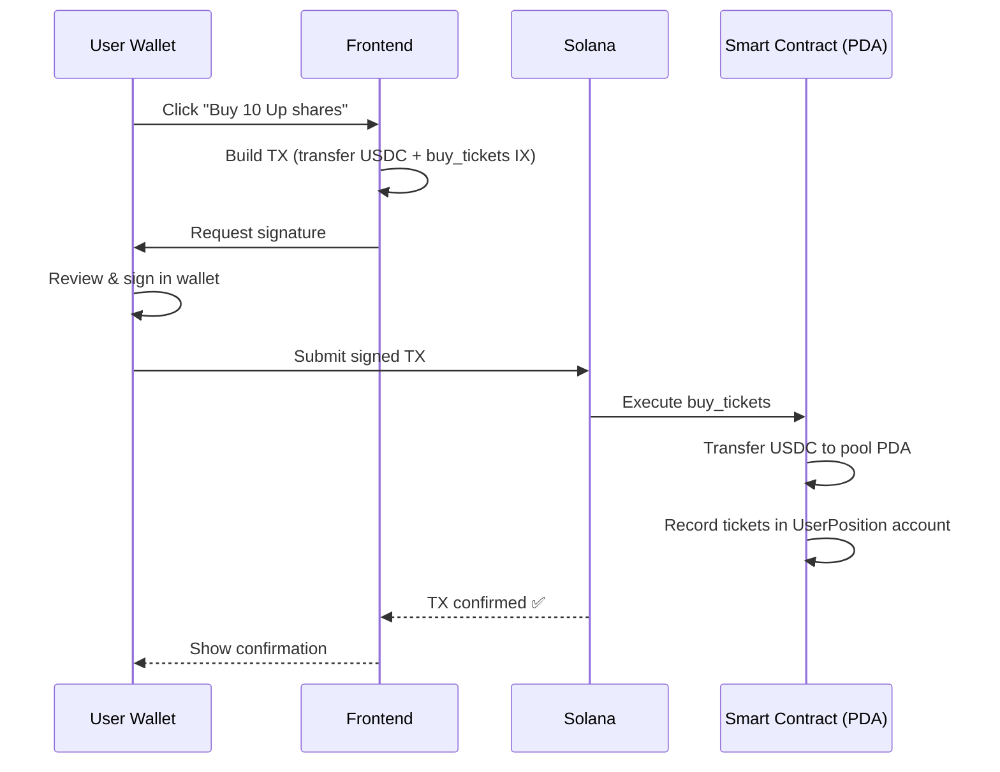
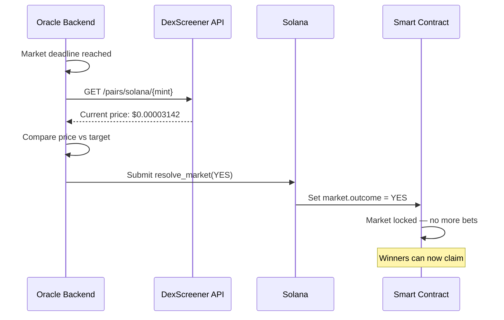

## System Architecture

SolMarket is composed of four layers that work together to create a trustless prediction market:

---

## Layer breakdown

<AccordionGroup>
  <Accordion title="🖥️ Frontend (React + Vite)" icon="desktop">
    The frontend is a React single-page application that:
    - Displays active and resolved markets
    - Constructs Solana transactions for ticket purchases
    - Sends transactions to the user's wallet for signing
    - **Never touches user funds** — only builds the unsigned TX

    The user signs every transaction with their own wallet (Phantom, Solflare). No private keys are ever sent to our servers.
  </Accordion>

  <Accordion title="⛓️ Smart Contract (Anchor / Rust)" icon="link">
    The on-chain program handles all financial logic:
    - **`buy_tickets`** — Transfers USDC from user to the market's PDA pool
    - **`resolve_market`** — Sets the outcome (only callable by the oracle authority)
    - **`claim_winnings`** — Calculates and distributes proportional payouts
    - **`refund`** — Returns funds if the market expires without resolution

    All funds are stored in Program Derived Addresses (PDAs). No human has the private key to these accounts.
  </Accordion>

  <Accordion title="🔮 Oracle (Backend Service)" icon="eye">
    The oracle is a backend service that:
    1. Monitors market expiry times
    2. Fetches the token price from DexScreener's public API at expiry
    3. Submits a `resolve_market` transaction with the result

    The oracle **cannot steal funds** — it can only set the market outcome to YES or NO. Fund distribution is handled entirely by the smart contract.
  </Accordion>

  <Accordion title="🗄️ Database (Supabase)" icon="database">
    Supabase stores non-financial metadata:
    - Market descriptions, token symbols, images
    - User profiles and display names
    - Bet history for portfolio display

    **No funds or private keys are stored in the database.** All financial state lives on-chain.
  </Accordion>
</AccordionGroup>

---

## Transaction Flow

Here's exactly what happens when you buy tickets:

<Note>
  The frontend **never has access** to your private key. It builds the transaction, your wallet signs it, and the blockchain executes it. If the frontend were compromised, the worst that could happen is showing you a wrong transaction — which you can always review before signing.
</Note>

---

## Resolution Flow

---

## What makes it trustless?

| Component | Who controls it? | Can they steal funds? |
|-----------|------------------|----------------------|
| **USDC Pool** | Smart contract PDA | ❌ No private key exists |
| **Payout math** | Smart contract code | ❌ Hardcoded, immutable |
| **Market resolution** | Oracle backend | ❌ Can only set YES/NO, not move funds |
| **Refund mechanism** | Smart contract | ❌ Automatic after deadline, permissionless |
| **Your wallet** | You | ✅ Only you sign transactions |
