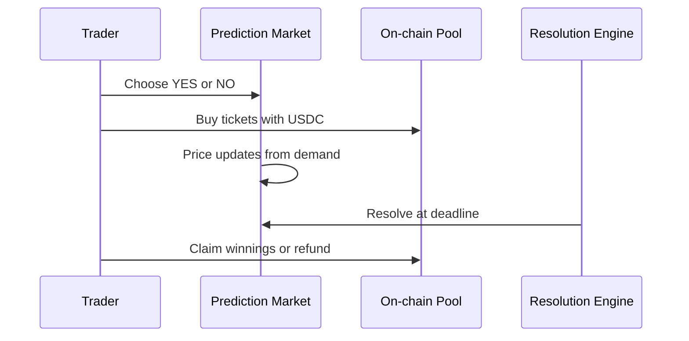
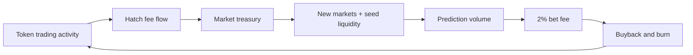

## The short version

SolMarket lets people trade short-term predictions on Solana tokens using USDC. Users pick a side, the market resolves at expiry, and winners claim their proportional share of the pool.

The system is designed around three public promises:

<CardGroup cols={3}>
  <Card title="Users control funds" icon="wallet">
    Users sign every transaction from their own wallet. SolMarket never takes custody of private keys.
  </Card>
  <Card title="Pools are on-chain" icon="vault">
    Market funds sit in program-controlled vaults and move only through claim or refund logic.
  </Card>
  <Card title="Resolution is auditable" icon="scale-balanced">
    Each market has a clear target, deadline, and outcome that can be checked against public market data.
  </Card>
</CardGroup>

---

## Market lifecycle

```mermaid
sequenceDiagram
    participant User as Trader
    participant Market as Prediction Market
    participant Vault as On-chain Pool
    participant Resolver as Resolution Engine

    User->>Market: Choose YES or NO
    User->>Vault: Buy tickets with USDC
    Market->>Market: Price updates from demand
    Resolver->>Market: Resolve at deadline
    User->>Vault: Claim winnings or refund
```

<Steps>
  <Step title="A market opens">
    SolMarket lists a clear question such as whether a token will be above a target price at a specific time.
  </Step>
  <Step title="Traders take a side">
    Users buy YES or NO tickets. Prices move as demand changes.
  </Step>
  <Step title="The market resolves">
    The resolution engine checks the agreed market data at expiry and submits the outcome.
  </Step>
  <Step title="Winners claim">
    Winning tickets split the pool proportionally. If a market cannot be resolved in time, refund logic protects users.
  </Step>
</Steps>

---

## The token flywheel

SolMarket is not only a prediction venue. It is designed to route activity back into the ecosystem.

```mermaid
graph LR
    A[Token trading activity] --> B[Hatch fee flow]
    B --> C[Market treasury]
    C --> D[New markets + seed liquidity]
    D --> E[Prediction volume]
    E --> F[2% bet fee]
    F --> G[Buyback and burn]
    G --> A
```

The goal is simple: use protocol activity to create more useful markets, visible liquidity, and ongoing deflationary pressure for $SOLMARKET.

---

## What users should care about

| Question | Answer |
|---|---|
| Who holds the market funds? | On-chain vaults controlled by program rules. |
| Who signs user trades? | The user's own wallet. |
| How are outcomes decided? | By a public resolution process at the market deadline. |
| What happens if resolution fails? | Refund protection lets participants recover funds after the deadline. |
| Where do protocol fees go? | Bet fees fund buyback and burn; Hatch SOL-side fees fund treasury operations and market growth. |
