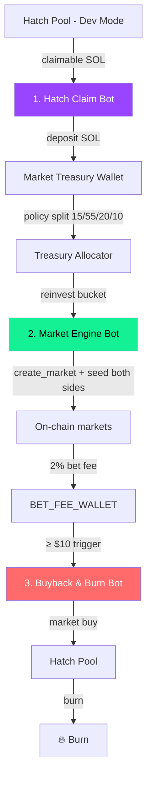
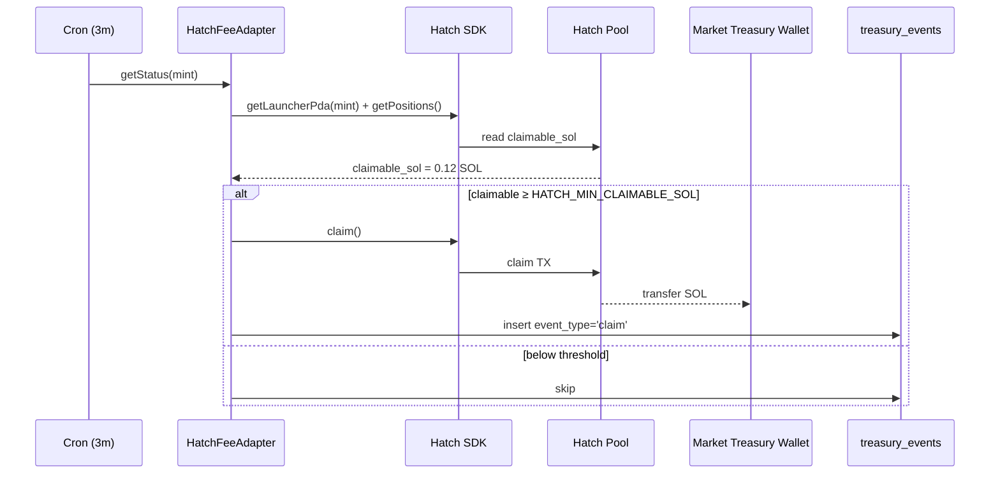
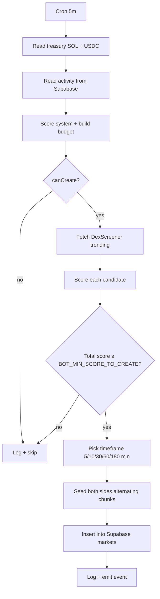
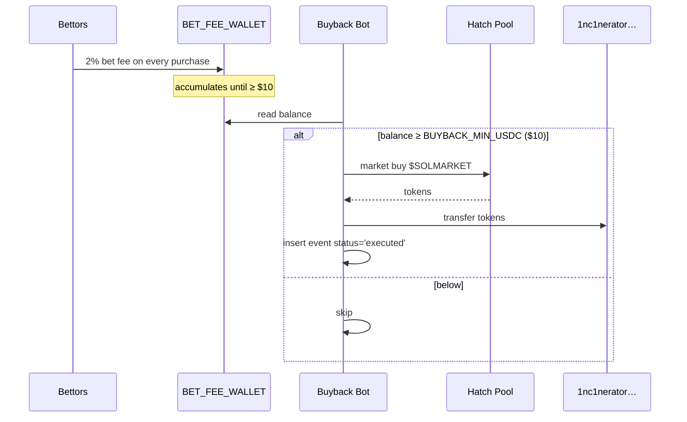

## The three-bot stack

SolMarket runs three independent cron jobs. Each one does one job, writes its result on-chain or to the audit DB, and never touches user funds.



| Bot | Schedule | Wallet | Current status |
|-----|----------|--------|----------------|
| **Hatch Claim Bot** | every `HATCH_CLAIM_INTERVAL_MIN` (default 3 min) | `CLAIM_BOT_PRIVATE_KEY` | Feature-gated until the Hatch SDK adapter is pinned |
| **Market Engine Bot** | every `BOT_CHECK_INTERVAL_MIN` (default 5 min) | `MARKET_TREASURY_PRIVATE_KEY` | Implemented: scans, scores, creates markets, and seeds both sides |
| **Buyback & Burn Bot** | every 10 min | `BUYBACK_BOT_PRIVATE_KEY` | Monitor implemented; swap + burn execution is intentionally gated |

<Warning>
  This page separates the **target protocol design** from the **current implementation state**. The market engine exists today. Hatch live claims and buyback swap execution require final SDK/router adapters before enabling production sends.
</Warning>

---

## Hatch Claim Bot

### What it does

The target bot periodically inspects the dev wallet's claimable SOL on the Hatch pool. When the claimable balance crosses `HATCH_MIN_CLAIMABLE_SOL` (default `0.05 SOL`), it submits a `claim` transaction using the [Hatch SDK](https://github.com/hatchfun/hatch-sdk).



### Configuration

```env
HATCH_FEES_ENABLED=true
HATCH_CLAIM_SEND_ENABLED=true        # off = dry-run only
HATCH_MIN_CLAIMABLE_SOL=0.05
HATCH_CLAIM_INTERVAL_MIN=3
CLAIM_BOT_PRIVATE_KEY=<secure signer, never committed>
PROJECT_TOKEN_MINT=...               # $SOLMARKET mint
```

### Treasury allocation policy

Each successful claim is recorded and split immediately by **basis points** (BPS). Defaults are conservative — most revenue is reserved or kept as profit, not auto-spent on markets.

| Bucket | BPS | Purpose |
|--------|-----|---------|
| `TREASURY_MARKET_REINVEST_BPS` | `1500` (15%) | Funds Market Engine seeds |
| `TREASURY_DEV_PROFIT_BPS` | `5500` (55%) | Founder/dev profit |
| `TREASURY_RESERVE_BPS` | `2000` (20%) | Strategic buffer |
| `TREASURY_OPERATIONS_BPS` | `1000` (10%) | RPC, monitoring, infra |

Example with `1.0 SOL` claimed:

| Bucket | Amount |
|--------|--------|
| Market reinvestment | `0.15 SOL` |
| Dev profit | `0.55 SOL` |
| Reserve | `0.20 SOL` |
| Operations | `0.10 SOL` |

<Note>
  See [Treasury & Market Bots](/protocol/treasury-bots) for the historical context on this policy and the spend caps that wrap it.
</Note>

### Current implementation state

The adapter (`backend/src/services/hatchFeeAdapter.ts`) is **feature-gated**:

- `HATCH_FEES_ENABLED=false` → `DisabledHatchFeeAdapter` returns zeros, never claims.
- `HATCH_FEES_ENABLED=true`, `HATCH_CLAIM_SEND_ENABLED=false` → reads status, never sends.
- `HATCH_FEES_ENABLED=true`, `HATCH_CLAIM_SEND_ENABLED=true` → **requires the pinned Hatch SDK adapter to be implemented**.

```ts
// FeatureGatedHatchFeeAdapter (placeholder)
async claim(): Promise<HatchClaimResult> {
  if (!config.hatchClaimSendEnabled) return { signatures: [], positionsClaimed: 0, estimatedSol: 0 };
  throw new Error("Refusing live Hatch claim: install and pin Hatch SDK, then implement claim().");
}
```

**To go live**: pin a specific commit of `@hatchfun/hatch-sdk`, implement `claim()` against `LbPair.claim`, and turn `HATCH_CLAIM_SEND_ENABLED=true`.

---

## Market Engine Bot

### What it does

Every `BOT_CHECK_INTERVAL_MIN` minutes the market engine:

1. Reads the **treasury wallet's** SOL + USDC balance.
2. Reads recent platform activity (`bets` last 1h / 24h, active markets, % with zero volume, recent claim deltas).
3. Computes a **system score** and an **affordable budget** (capped, never spends the whole treasury).
4. Pulls trending Solana memecoins from DexScreener and **scores each candidate** (volume, txns, liquidity, volatility, FDV band).
5. For the highest combined-score candidates that pass the duplicate filter, calls `create_market` on-chain and **seeds both sides in tiny alternating chunks** so the price stays close to 50/50.



### Adaptive behaviour you asked for

The engine reads, in real time, both **how much money is coming in** and **how much volume the existing markets are doing**. The decision matrix:

| Treasury & activity signal | Engine response |
|----------------------------|-----------------|
| Treasury below `MARKET_MIN_TREASURY_USDC` (default `$10`) | Skip — never touch the floor |
| Treasury healthy + low platform volume per market | Conservative mode: 1 short market, smallest seed |
| Recent Hatch claim ≥ `0.05 SOL` + healthy treasury + ≥ `$50` volume / market / 1h | Up to 3 markets, normal seed (`$5/side`) |
| Recent claim ≥ `0.5 SOL` + spendable ≥ `$200` + system score ≥ 100 | Premium mode: up to 4 markets, full timeframe set 5 → 1440 min, seed up to `$10/side` |
| ≥ 50% of active markets have zero volume | **Conservative override** — fewer/shorter markets regardless of treasury |

### Hot tokens vs new opportunities

- **Hot token detection** — DexScreener `m5` and `h1` volume + `txns5m` + price change drive the candidate score. A token already in our active set is filtered by `hasDuplicateMarket(candidate, timeframe)` so we don't double up on the same target.
- **New opportunities** — the search hits DexScreener with multiple queries (`solana memecoin`, common ticker grab) every cycle, so brand-new tokens passing the filters (FDV `500K`–`100M`, h24 volume ≥ `250K`, liquidity ≥ `50K`) enter the funnel automatically.
- **Ramp-down** — when `recent_zero_volume_rate ≥ 0.5` or system score `< 30`, no new markets are created. The bot also enforces `MAX_AUTO_MARKETS_PER_HOUR=3`.

### Symmetric seed (so the first bettor still earns)

Markets are seeded by alternating tiny chunks (`2 USDC` per side per chunk) so that:

- The first organic bettor finds a real liquid pool, not an empty one.
- Both YES and NO are seeded in equal USDC, so odds stay close to `50/50` until real flow arrives.
- The treasury never seeds more than `BOT_SEED_MAX_USDC_PER_SIDE` (default `$10`) per market.

### Configuration

```env
BOT_CHECK_INTERVAL_MIN=5
MAX_AUTO_MARKETS_PER_HOUR=3
BOT_MIN_SCORE_TO_CREATE=90
BOT_SEED_MIN_USDC_PER_SIDE=2
BOT_SEED_SHORT_USDC=2
BOT_SEED_NORMAL_USDC=5
BOT_SEED_PREMIUM_USDC=10
BOT_SEED_MAX_USDC_PER_SIDE=10
TREASURY_MAX_MARKET_SPEND_BPS=1000          # 10% of spendable
TREASURY_MARKET_RUNWAY_CAP_USDC=250         # absolute hard cap
MARKET_MIN_TREASURY_USDC=10
MARKET_MIN_TREASURY_SOL=0.05
BOT_LONG_MARKET_EVERY_N=8                   # every 8 markets, attempt a 3h+ market
```

---

## Buyback &amp; Burn Bot

### What it does

Every 10 minutes it inspects `BET_FEE_WALLET` (the wallet that receives the **2% bet fee** from every prediction-market purchase). When the wallet crosses the configured floor it records a `buyback_burn_event`.

The target production execution path is:

1. Swaps the accumulated USDC/SOL for $SOLMARKET on the Hatch pool.
2. Sends the bought tokens to the burn address `1nc1nerator11111111111111111111111111111111`.
3. Marks the event `executed` with the on-chain signatures.



### Current implementation state

The current backend monitor records threshold events and marks them as `simulated` or `pending` depending on `BUYBACK_BURN_ENABLED` and `BUYBACK_DRY_RUN`. The swap route into the Hatch pool and the final burn transaction should remain disabled until the router adapter is tested with a capped signer.

### Floor configuration

The user-visible promise is **"wait until at least \$10 has accumulated before doing a buy &amp; burn"**. To match exactly, set:

```env
BUYBACK_MIN_USDC=10
BUYBACK_MIN_SOL=0.05
BUYBACK_BURN_ENABLED=true
BUYBACK_DRY_RUN=false
```

<Info>
  Public docs commit to a $10 floor. Set `BUYBACK_MIN_USDC=10` in production before enabling live buyback execution.
</Info>

---

## Production go-live checklist

<Steps>
  <Step title="Pin the Hatch SDK">
    Pin a specific commit or release of `@hatchfun/hatch-sdk`, implement `FeatureGatedHatchFeeAdapter.claim()`, and test claims with `HATCH_CLAIM_SEND_ENABLED=false` before live sends.
  </Step>
  <Step title="Fund and cap bot signers">
    Keep claim, treasury, and buyback signers separate. Fund each with only the balance needed for its role and keep private keys outside the repository.
  </Step>
  <Step title="Enable buyback execution only after route tests">
    The monitor can run before execution. Only set `BUYBACK_BURN_ENABLED=true` and `BUYBACK_DRY_RUN=false` after the Hatch swap route and burn transfer are verified on-chain.
  </Step>
  <Step title="Switch holder gate to supply share">
    Replace the current absolute token gate with a BPS-based circulating supply check before advertising the 1% / 0.5% gate as live.
  </Step>
</Steps>

---

## Observability

Every bot writes to Supabase tables that double as the audit log:

| Table | Written by | Contents |
|-------|------------|----------|
| `bot_runs` | all bots | start/stop/error per run |
| `treasury_events` | Hatch Claim Bot | every SOL inflow + tx signature |
| `treasury_allocations` | Hatch Claim Bot | the 15/55/20/10 split per event |
| `markets` + `market_seed_events` | Market Engine | every auto market + seed signatures |
| `buyback_burn_events` | Buyback Bot | every threshold trigger + execution status |

These tables back the running dashboard the team uses to watch the bots in real time. **Nothing is taken on trust** — every claim, allocation, market, and burn is a row tied to a Solana signature.

---

## Failure modes &amp; safety rails

<AccordionGroup>
  <Accordion title="Hatch SDK adapter not pinned" icon="triangle-exclamation">
    `claim()` throws and the bot logs `error`. No SOL is moved. Status reads still work; on the next deploy with the pinned SDK, claims resume automatically.
  </Accordion>
  <Accordion title="Treasury under floor" icon="gas-pump">
    `MARKET_MIN_TREASURY_SOL` and `MARKET_MIN_TREASURY_USDC` act as a runway floor. The Market Engine simply skips the cycle and logs the reason.
  </Accordion>
  <Accordion title="Too many zero-volume markets" icon="chart-line-down">
    The engine enters conservative mode: shorter markets, smaller seed, max 1 per cycle. This protects the treasury from over-spending on a quiet platform.
  </Accordion>
  <Accordion title="Buyback amount too small" icon="dollar-sign">
    The Buyback Bot records threshold state but should not execute below `BUYBACK_MIN_USDC`. This avoids wasting SOL on gas-vs-spend ratios that don't make sense.
  </Accordion>
  <Accordion title="Bot crashes mid-cycle" icon="bug">
    `recordBotRun` wraps every cycle. Errors are written to `bot_runs.error` and the next cron tick starts cleanly. Cycles are guarded by an in-memory mutex so two won't overlap.
  </Accordion>
</AccordionGroup>
