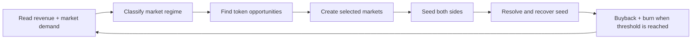
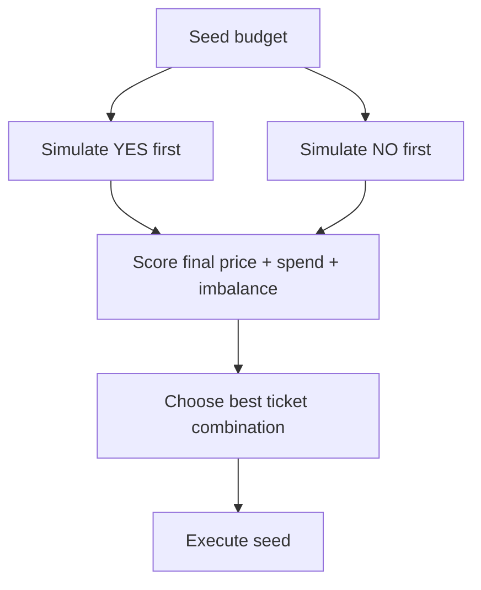

## Why this exists

SolMarket should feel alive without wasting treasury. The automated system is designed to deploy capital only when there is a reason, recover capital after markets settle, and show users that protocol revenue is working.

The principle is:

<Info>
  Recover first. Deploy second. Scale only where users prove demand.
</Info>

---

## The operating loop

The system has one professional goal: allocate capital where it can create useful volume, visibility, and positive protocol return.

---

## Signals used

| Signal | What it means | Why it matters |
|---|---|---|
| Token trading fees | Attention around $SOLMARKET | Shows token-side demand. |
| Prediction-market volume | Demand for the product | Shows users want to trade markets. |
| Volume breadth | How many markets have real activity | Separates healthy demand from one-off spikes. |
| Top-market concentration | Whether volume is stuck in 2-3 markets | Helps avoid wasting seed on dead long-tail markets. |
| Seed recovery | How much seeded capital comes back | Protects the treasury from bad market types. |
| Treasury runway | Available capital after reserves | Prevents over-expansion. |
| Community requests | Holder and partner demand | Keeps users feeling heard. |

---

## Regime playbook

| Situation | Diagnosis | Markets created | Seed level | Response |
|---|---|---:|---:|---|
| High token fees, low market volume | Token is getting attention, product has not caught up yet | Low | Probe or Standard | Create fewer markets, focus on the most obvious narratives, avoid over-spending. |
| High market volume, low token fees | Product is getting attention, token has not caught up yet | Medium-high | Standard or Strong | Create more markets, use prediction fees to build buyback pressure. |
| 2-3 markets dominate volume | Specific tokens or narratives are working | Medium | Strong for winners, Probe for discovery | Repeat proven formats, reduce long-tail experiments. |
| Low token fees and low market volume | Cold regime | Very low | Probe only | Protect capital, recover open positions, wait for better signals. |
| High token fees and broad market volume | Expansion regime | High with caps | Standard and Strong | Scale creation while respecting daily spend limits. |
| High volume but weak seed recovery | Users are beating treasury seed | Lower | Probe | Reduce liquidity until the strategy improves. |
| Many expired/unclaimed markets | Operational cleanup needed | Pause | None | Settle and recover capital before creating more markets. |

---

## Opportunity engine

The engine looks for two main opportunity types.

### Momentum tokens

These are tokens with fast price movement, rising volume, and active trading. They are good for short-duration markets because users already have an opinion.

Examples:

| Signal | Desired behavior |
|---|---|
| Strong 5-minute move | Market around continuation or rejection. |
| Strong 1-hour move | Market around holding the breakout. |
| Rising trade count | Confirms that movement is not just one trade. |
| Healthy liquidity | Reduces manipulation risk. |

### Pullback tokens

These are larger tokens that drop sharply while still having liquidity and attention. They are good for rebound/rejection markets.

Examples:

| Signal | Desired behavior |
|---|---|
| Large token with sudden drawdown | Recovery market. |
| High volume during the drop | Confirms public attention. |
| Liquidity remains strong | Reduces fake breakdown risk. |
| Community discussion increases | Improves market participation odds. |

---

## Seed liquidity policy

Seed is not charity. It is working capital. It gives the first trader a real market while giving the protocol a recoverable position.

| Tier | Target seed | When to use |
|---|---:|---|
| Probe | Around $5 per side | New token, uncertain demand, holder proposal without history. |
| Standard | Around $10 per side | Good signal, healthy liquidity, normal market. |
| Strong | Around $20 per side | Proven narrative, strong product volume, or repeat winner. |
| Premium | Around $50 per side | Manual, partner, or sponsored markets only at the beginning. |

The default automatic range should be Probe to Strong. Premium should require human approval until there is enough seed recovery history.

---

## Balanced seeding

Buying the same dollar amount on both sides is not always the best way to finish balanced, because each buy moves the price. The orchestrator should calculate tickets, simulate both orders, and pick the combination that ends closest to 50/50.

The optimizer should score each candidate by:

| Factor | Goal |
|---|---|
| Final price | Finish as close as possible to 50/50. |
| Spend | Stay near the target seed tier. |
| Ticket balance | Avoid building a one-sided treasury position. |
| Pool balance | Keep both sides visually credible. |
| Transaction count | Avoid unnecessary execution cost. |

This can produce asymmetric execution such as buying slightly more tickets on one side than the other if that is what leaves the final market cleaner.

---

## Capital allocation

In a normal regime, the market budget should be split like this:

| Bucket | Share | Purpose |
|---|---:|---|
| Proven winners | 50% | Repeat tokens, timeframes, and narratives that already generate volume. |
| Trending discovery | 25% | New momentum tokens with strong public attention. |
| Pullback opportunities | 15% | Larger tokens that moved sharply and attract debate. |
| Community proposals | 10% | Holder requests and sponsored visibility. |

In a cold regime, most of this budget should remain unused. In an expansion regime, the system can increase creation but still keeps hard daily and per-market caps.

---

## Recovery engine

Every seeded market must be closed out.

| Market state | Bot action |
|---|---|
| Resolved and treasury holds winning tickets | Claim winnings. |
| Resolved and treasury holds losing tickets | Mark loss and record recovery. |
| Expired without valid resolution | Refund treasury position. |
| Already claimed or refunded | Skip. |

The recovery engine measures:

| Metric | Meaning |
|---|---|
| Seed spent | How much working capital was deployed. |
| Seed recovered | How much came back through claim or refund. |
| Seed PnL | Recovery minus seed spent. |
| Organic volume per seed | How much user volume each seeded dollar generated. |

These metrics decide whether future markets get more seed, less seed, or no seed.

---

## Guardrails

| Guardrail | Purpose |
|---|---|
| Daily spend cap | Prevents hype from draining treasury. |
| Per-market seed cap | Keeps a single bad market from hurting runway. |
| Reserve floor | Keeps SOL and USDC available for operations. |
| Zero-volume penalty | Reduces creation when markets are not being used. |
| Recovery penalty | Reduces seed when treasury positions underperform. |
| Concentration control | Avoids pretending the whole platform is healthy when only one token is active. |

The strongest signal is not hype. It is repeat user demand combined with recoverable capital.
