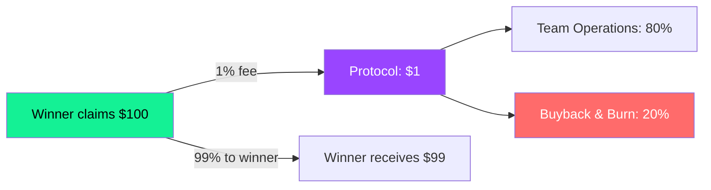

## Overview

SolMarket charges a minimal fee on winning claims to fund protocol development, $SOLMARKET buybacks, and operational costs.

<Info>
  **Current protocol fee: 1% on winning claims only.** 
  Losing bets are NOT charged any fee — you only pay if you win.
</Info>

---

## How fees work

| Scenario | Amount | Fee |
|----------|--------|-----|
| You buy 10 shares at 50¢ | $5.00 | $0 (no fee on purchase) |
| Market resolves in your favor | — | — |
| Your payout from the pool | $9.50 | $0.095 (1% of payout) |
| **You receive** | **$9.405** | — |

---

## Fee distribution

From every dollar collected in fees:

| Allocation | Percentage | Purpose |
|------------|------------|---------|
| **Team & Operations** | 80% | Server costs, development, marketing |
| **$SOLMARKET Buyback & Burn** | 20% | Buying $SOLMARKET tokens on the open market and burning them permanently |

<Tip>
  The buyback & burn mechanism creates deflationary pressure on $SOLMARKET. Every market that resolves on SolMarket contributes to reducing the token supply. See [$SOLMARKET Buyback & Burn](/token/buyback-burn) for details.
</Tip>

---

## Why only 1%?

We intentionally set a low fee to:

1. **Maximize user returns** — In a parimutuel system, every basis point matters
2. **Encourage volume** — Lower fees = more participation = bigger pools = better payouts
3. **Be competitive** — Polymarket charges 0-2% depending on the interface. We stay competitive.

---

## Fee transparency

All fees are deducted **on-chain** by the smart contract during the `claim_winnings` instruction. This means:

- The fee percentage is **hardcoded** in the program — it cannot be changed without a program upgrade
- Every fee deduction is a **verifiable Solana transaction**
- The fee amount for any claim can be calculated by anyone: `payout × 0.01`

<Note>
  The fee is coded as `FEE_BPS = 100` (100 basis points = 1%) in the smart contract. This is visible in the program source code.
</Note>
