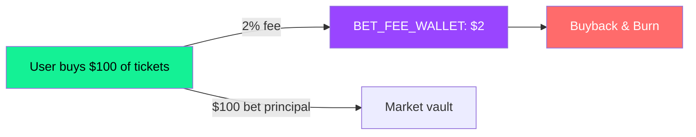

## Overview

SolMarket charges a simple prediction-market fee at purchase time. This fee is routed to the buyback wallet and kept separate from market treasury funds.

<Info>
  **Current prediction-market fee: 2% on each bet purchase.** 
  Market seed capital and token-fee claims use a separate treasury flow.
</Info>

---

## How fees work

```mermaid
graph LR
    A[User buys $100 of tickets] -->|2% fee| B[BET_FEE_WALLET: $2]
    A -->|$100 bet principal| C[Market vault]
    B --> E[Buyback & Burn]
    style A fill:#14F195,color:#000
    style B fill:#9945FF,color:#fff
    style E fill:#FF6B6B,color:#fff
```

| Scenario | Amount | Fee |
|----------|--------|-----|
| You buy 10 shares at 50¢ | $5.00 | $0.10 fee |
| Market resolves in your favor | — | — |
| Your payout from the pool | $9.50 | $0 claim fee |
| **You receive** | **$9.50** | — |

---

## Fee distribution

Prediction-market fees are routed to buyback and burn:

| Allocation | Percentage | Purpose |
|------------|------------|---------|
| **$SOLMARKET Buyback & Burn** | 100% of prediction-market fees | Buying $SOLMARKET tokens on the open market and burning them permanently |

Token-fee claims use a separate allocation policy: `15%` market reinvestment, `55%` developer/profit, `20%` reserve, and `10%` operations. See [Treasury & Market Bots](/protocol/treasury-bots).

<Tip>
  The buyback & burn mechanism creates deflationary pressure on $SOLMARKET. Every bet contributes to the buyback wallet. See [$SOLMARKET Buyback & Burn](/token/buyback-burn) for details.
</Tip>

---

## Why 2%?

We intentionally set a low fee to:

1. **Keep markets simple** — Users see the fee before signing the purchase transaction.
2. **Fund token demand** — Fees create a direct buyback-and-burn budget.
3. **Avoid claim friction** — Winners do not pay a second fee when claiming.

---

## Fee transparency

Bet fees are transferred in the signed purchase transaction before the `buy_tickets` instruction. This means:

- The user sees the total cost before signing.
- The fee transfer to `BET_FEE_WALLET` is visible on-chain.
- The market vault receives the bet principal; the buyback wallet receives the fee.

<Note>
  The current frontend/backend config uses `FEE_BPS=200` (200 basis points = 2%). The claim instruction itself does not deduct a separate protocol fee.
</Note>
