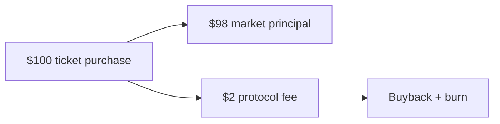
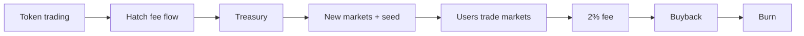

## Simple fee model

SolMarket charges a 2% fee when a user buys prediction-market tickets. The fee goes to the buyback and burn wallet. The user's market principal stays in the market pool.

```mermaid
graph LR
    A[$100 ticket purchase] --> B[$98 market principal]
    A --> C[$2 protocol fee]
    C --> D[Buyback + burn]
```

<Info>
  Winning claims do not pay a second protocol fee.
</Info>

---

## Fee destinations

| Flow | Destination | Purpose |
|---|---|---|
| Prediction-market purchase fee | Buyback wallet | Buy $SOLMARKET and burn it. |
| Hatch SOL-side fees | Market treasury | Fund reserves, operations, and selective market seed. |
| Hatch token-side fees | Burn | Reduce token supply automatically. |

---

## Buyback threshold

The buyback wallet should wait until at least $10 has accumulated before executing a buy and burn. This avoids tiny, noisy burns and creates a more visible proof of protocol activity.

| Accumulated fees | Action |
|---|---|
| Below $10 | Keep accumulating. |
| $10 or more | Execute buyback and burn when operating conditions are healthy. |

---

## Why 2%

The fee is intentionally simple:

| Reason | Benefit |
|---|---|
| Easy to understand | Users know the cost before signing. |
| Direct token support | Prediction volume creates buyback demand. |
| No claim friction | Winners do not pay another fee to claim. |
| Clean public story | Volume turns into buybacks and burns. |

---

## Full value loop

```mermaid
graph LR
    A[Users trade markets] --> B[2% fee]
    B --> C[Buyback]
    C --> D[Burn]
    E[Token trading] --> F[Hatch fee flow]
    F --> G[Treasury]
    G --> H[New markets + seed]
    H --> A
```

This keeps the model easy to explain: market activity supports the token, and token activity helps fund more markets.
