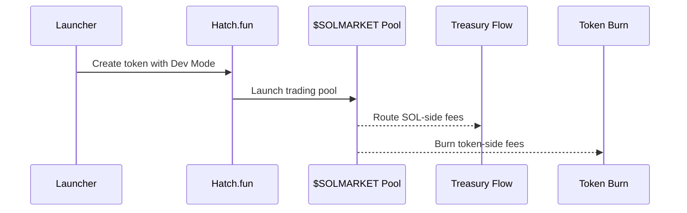

## Why Hatch.fun

$SOLMARKET launches on **[hatchfun.xyz](https://www.hatchfun.xyz/)** using Dev Mode. The setup matters because it gives the token economy two simple, public flows:

<CardGroup cols={2}>
  <Card title="SOL-side fees to treasury" icon="hand-holding-dollar">
    SOL-side trading fees flow to the launcher wallet, where they can be claimed and allocated by treasury policy.
  </Card>
  <Card title="Token-side fees burn" icon="fire">
    Token-side fees are burned automatically at the pool level, reducing circulating supply through trading activity.
  </Card>
</CardGroup>

<Info>
  This creates a clean flywheel: token trading funds treasury activity, and token-side fees reduce supply.
</Info>

---

## Launch flow

---

## Economic role

| Flow | Role |
|---|---|
| SOL-side fees | Fund reserves, operations, selected market creation, and seed liquidity. |
| Token-side fees | Reduce token supply automatically. |
| Prediction-market fees | Fund buyback and burn separately. |

These flows are intentionally separated. Treasury capital funds product growth. Prediction-market fees support token buybacks. Token-side trading fees burn automatically.

---

## Why this is clean

<AccordionGroup>
  <Accordion title="No complex fee story" icon="receipt">
    Users can understand the model quickly: one side funds treasury, the other side burns.
  </Accordion>
  <Accordion title="No manual token burn step" icon="fire">
    Token-side fees burn at the pool level, so the burn does not depend on a manual team action.
  </Accordion>
  <Accordion title="Revenue can be seen working" icon="chart-line">
    Claimed SOL-side fees can be routed into market creation, seed liquidity, reserves, and operations.
  </Accordion>
  <Accordion title="Aligned holder access" icon="users">
    As supply decreases, meaningful holders can become more important participants in market curation.
  </Accordion>
</AccordionGroup>

---

## What will be published after launch

| Item | Why it matters |
|---|---|
| Token mint | Lets users verify the correct asset. |
| Pool page | Lets users verify Dev Mode fee routing. |
| Treasury reporting | Shows how SOL-side fees are allocated. |
| Burn reporting | Shows supply reduction over time. |
