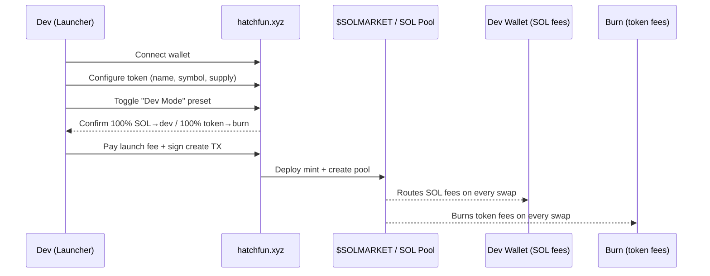
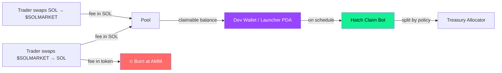

## Why Hatch.fun

$SOLMARKET launches on **[hatchfun.xyz](https://www.hatchfun.xyz/)** using the platform's **Dev Mode** preset. Dev Mode hard-codes two properties at the AMM level so the protocol can run a sustainable, on-chain economy without manual bookkeeping:

<CardGroup cols={2}>
  <Card title="100% SOL-side fees → dev wallet" icon="hand-holding-dollar">
    Every SOL that the pool collects on swaps is routed to the **token launcher wallet** (the SolMarket dev wallet). This becomes the single revenue stream for the Hatch Claim Bot.
  </Card>
  <Card title="100% token-side fees → burn" icon="fire">
    Every $SOLMARKET token collected as a fee is **burnt at the AMM level**. There is no router, no human signer, and no opt-out. Every swap reduces circulating supply.
  </Card>
</CardGroup>

<Info>
  Dev Mode is the closest thing on Hatch to a built-in deflationary PvE: the pool fights against its own supply on every trade, and the protocol earns SOL it can route into bots, treasury, and buyback.
</Info>

---

## Launch flow

---

## What goes on-chain at launch

| Property | Value | Notes |
|----------|-------|-------|
| **Launch platform** | Hatch.fun | DLMM-based bonding pool |
| **Mode** | Dev Mode | Required preset |
| **SOL fee receiver** | `DEV_WALLET` (launcher) | 100% of SOL-denominated fees |
| **Token fee receiver** | Burn | 100% burn at AMM level |
| **Mint address** | `TBA at launch` | Will be published in [Tokenomics](/token/tokenomics) |
| **Pool / lbPair address** | `TBA at launch` | Required by the [Hatch Claim Bot](/protocol/bot-architecture#hatch-claim-bot) |

<Warning>
  **Don't change the Dev Mode preset.** The bot stack assumes 100/100 routing. If the pool config diverges, the Hatch Claim Bot will still claim, but the deflationary PvE assumption documented here breaks.
</Warning>

---

## What the dev wallet receives

The dev wallet is **not** a profit wallet — it's the **inbox for the Hatch Claim Bot**. Every SOL collected by the pool sits in the launcher's claimable balance until the bot claims it.

The full lifecycle of those SOL fees — claim, allocate, reinvest, buyback — is described in [Bot Architecture](/protocol/bot-architecture).

---

## Why this design is honest

<AccordionGroup>
  <Accordion title="No hidden tax" icon="receipt">
    Hatch shows the fee split publicly on the pool page. Anyone can verify that the dev wallet only receives the SOL-side fee and that the token-side is burnt.
  </Accordion>
  <Accordion title="No mint authority abuse" icon="shield">
    The mint authority is renounced or locked at launch (depending on Hatch's flow at that moment). The bot stack only **buys** $SOLMARKET on the open market — it never mints new supply.
  </Accordion>
  <Accordion title="Burn is automatic" icon="fire">
    Token-side fees never touch a human wallet. There is no scenario where the team "forgets" to burn — the AMM does it on every swap.
  </Accordion>
  <Accordion title="Top-holder voting power" icon="users">
    Because supply only goes down, holding a fixed amount of $SOLMARKET represents a **growing share** of the supply over time. This is what enables the [holder-gated /create-market](/protocol/holder-gate) flow.
  </Accordion>
</AccordionGroup>

---

## Verifying Dev Mode after launch

Once the pool is live you can verify the setup yourself:

<Steps>
  <Step title="Open the pool on Hatch.fun">
    Navigate to the $SOLMARKET pool page on hatchfun.xyz. The Dev Mode badge and the SOL-fee / token-burn split should be visible.
  </Step>
  <Step title="Check the launcher claim PDA">
    Use the [Hatch SDK](https://github.com/hatchfun/hatch-sdk) `getLauncherPda(mint)` helper or read the pool account on Solscan. The `claimable_sol` field grows on every swap.
  </Step>
  <Step title="Match against Treasury inflows">
    Each successful claim is recorded in our `treasury_events` table and surfaced in the [Bot Architecture dashboard](/protocol/bot-architecture#observability). On-chain claim signatures match the SOL deltas.
  </Step>
</Steps>

<Tip>
  The Hatch Claim Bot is feature-gated until the Hatch SDK adapter is pinned and tested. During this phase it can record status and treasury deltas, but it should not execute live claims. See [Bot Architecture → Hatch Claim Bot](/protocol/bot-architecture#hatch-claim-bot) for the production switch.
</Tip>
