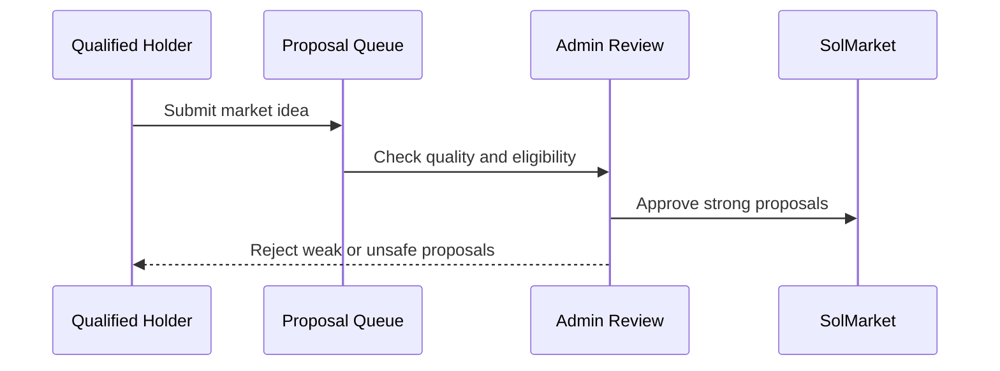

## Why holder proposals exist

The automated engine finds obvious opportunities. Holders help surface the markets the community cares about: partner tokens, niche narratives, and projects that deserve visibility.

This keeps SolMarket from becoming only an algorithmic feed. Users should feel that the protocol listens.

---

## Eligibility

Access is based on share of circulating supply, not a fixed token count.

| Phase | Required holding | Purpose |
|---|---:|---|
| Bootstrap | 1.00% of circulating supply | Keep proposals scarce and high-signal early. |
| Expansion | 0.50% of circulating supply | Open access as the token and product mature. |

<Info>
  Because $SOLMARKET is deflationary, a committed holder's share can become more meaningful over time as supply decreases.
</Info>

---

## Proposal flow

<Steps>
  <Step title="Holder submits a market">
    The proposer chooses the token, target, timeframe, and market thesis.
  </Step>
  <Step title="Eligibility is checked">
    The wallet must still meet the holder threshold when the proposal is reviewed.
  </Step>
  <Step title="Admins review quality">
    Admins check whether the market is safe, resolvable, and likely to attract real participation.
  </Step>
  <Step title="Approved markets go live">
    Strong proposals become markets and may receive treasury seed based on the current capital regime.
  </Step>
</Steps>

---

## Approval standards

Admins approve proposals that are:

| Standard | Meaning |
|---|---|
| Credible token | Real liquidity, real community, no obvious scam signals. |
| Clear outcome | The question can be resolved objectively. |
| Reasonable timeframe | The market is not absurdly short or impossibly long. |
| Useful visibility | The market adds value for traders or the wider community. |

Admins reject proposals that are low-quality, unsafe, impossible to resolve, duplicated, or clearly designed to mislead users.

---

## Sponsored visibility

Holder proposals can also support teams that want visibility for their own token. The gate keeps this aligned: a proposer must hold meaningful $SOLMARKET exposure before asking the venue to promote a market.

This is not pay-to-list. It is aligned curation.

---

## How proposals affect the bot

Holder requests become one input into the Capital Orchestrator. They do not bypass risk controls.

| Proposal type | Likely seed |
|---|---:|
| New or unproven token | Probe |
| Strong community request | Standard |
| Proven token with prior market volume | Strong |
| Partner or sponsored market | Standard or Strong, subject to review |

The bot can prioritize community requests, but only when the treasury has enough runway and the market passes quality checks.
