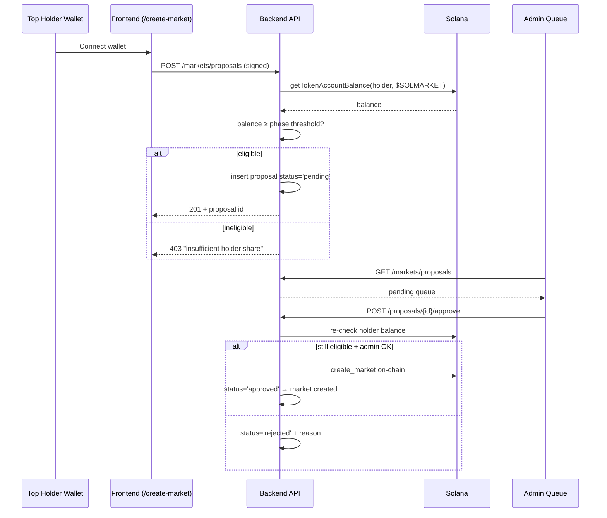

## Two complementary creation paths

| Path | Who | What |
|------|-----|------|
| **Automatic** | [Market Engine Bot](/protocol/bot-architecture#market-engine-bot) | Continuously scans DexScreener and creates markets on hot tokens / new opportunities. |
| **Holder-proposed** | $SOLMARKET top holders via `/create-market` | Holders propose markets they want to see (their own token, an interesting niche, an ecosystem partner). Admins review and approve. |

The Market Engine handles **discovery**. The Holder Gate handles **community curation and sponsorship**.

---

## Eligibility — the supply-share threshold

To open `/create-market` your wallet must hold a **minimum share of $SOLMARKET supply**, scaled in two phases that follow the price/market-cap of the token.

| Phase | Trigger | Required share of supply |
|-------|---------|--------------------------|
| **Phase 1 — Bootstrap** | From launch up to a sustained price appreciation milestone | **≥ 1.00%** of circulating supply |
| **Phase 2 — Expansion** | After the protocol-defined price/market-cap milestone is reached | **≥ 0.50%** of circulating supply |

<Info>
  The threshold is intentionally **a share of supply, not an absolute token amount**. Because $SOLMARKET supply only goes down (continuous burn from Hatch + buyback), the absolute token count required for 1% drifts down over time. This is the deflationary PvE working in the holder's favor.
</Info>

### Why two phases

- **Phase 1 (1%)** keeps the gate meaningful while liquidity is thin and 1% is still affordable. It also keeps the proposal queue small and high-signal in the bootstrap weeks.
- **Phase 2 (0.5%)** widens access once the token has proven traction. Lowering the bar grows the curation surface without diluting the gate's purpose.

### Implementation note

Today the backend gate is implemented with an **absolute token count** (`CREATOR_MIN_TOKEN_BALANCE`, default `10`). To enforce the supply-share rule documented above, the gate needs a small enhancement:

```ts
// pseudo-code for routes/markets.ts → POST /proposals
const supply = await getCirculatingSupply(config.projectTokenMint);
const requiredBps = phase === "expansion" ? 50 : 100;     // 0.5% / 1%
const requiredTokens = Math.ceil((supply * requiredBps) / 10_000);
if (tokenBalance < requiredTokens) return res.status(403).json({ error: "Insufficient holder share" });
```

The phase boundary is governed off-chain (admin flag) or read from a price oracle — both paths are explicitly recorded in the proposal row for auditability.

---

## End-to-end flow



---

## Admin review criteria

Admins **reject** proposals when:

- **Underlying token is low quality** — micro-cap with no real liquidity, or a market the team can't safely resolve.
- **Token is not credible** — known rug, fake project, fake mint, or copycat of another project.
- **Wrong market parameters** — target price unreachable, duration absurd, or duplicate of an existing live market.

Admins **approve** proposals when:

- The proposer still holds the required share at review time.
- The token clears a basic credibility check (real DexScreener pair, healthy liquidity, recognisable project or transparent team).
- The market parameters are reasonable.

<Note>
  The proposer's share is **re-checked on-chain at approval time**. If the holder dumped between submission and approval, the proposal is auto-rejected with `Proposer no longer holds at least N project tokens`.
</Note>

---

## Why this exists

<CardGroup cols={2}>
  <Card title="Sponsor your own token" icon="megaphone">
    A token team that holds 1% / 0.5% of $SOLMARKET can propose markets on their token, gaining visibility on a popular prediction-market venue.
  </Card>
  <Card title="Curate the long tail" icon="binoculars">
    The bot focuses on the top of DexScreener. Holders surface tokens the bot wouldn't touch — niche memes, fresh launches with vouching, ecosystem partners.
  </Card>
  <Card title="Aligned skin in the game" icon="handshake">
    The gate ensures every proposer is materially long $SOLMARKET. Bad-faith proposals cost real holdings.
  </Card>
  <Card title="No pay-to-list trap" icon="shield-check">
    Anyone can propose if they qualify. Admins only have a veto, not a list of paid slots — keeping the platform credibly neutral.
  </Card>
</CardGroup>

---

## API summary

The backend exposes the proposal endpoints and protects them with wallet-signature authentication. Today the gate checks an absolute project-token balance; the production target is the supply-share threshold described above.

| Method | Endpoint | Who | Notes |
|--------|----------|-----|-------|
| `POST` | `/api/v1/markets/proposals` | Any signed holder | Currently checks token balance; target is 1% / 0.5% supply share |
| `GET` | `/api/v1/markets/proposals` | Admin wallet | Returns the pending queue |
| `POST` | `/api/v1/markets/proposals/:id/approve` | Admin wallet | Re-checks holder balance, then approves or attaches the created market |
| `POST` | `/api/v1/markets/proposals/:id/reject` | Admin wallet | Records the rejection reason |

See [API Reference](/api-reference/introduction) for full request/response shapes.
