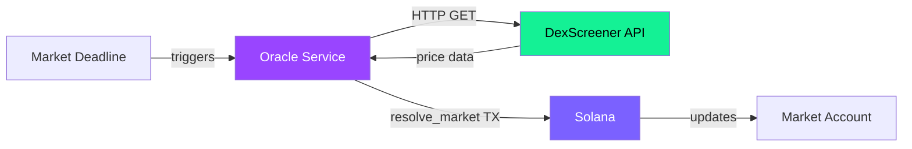

## How the oracle works

SolMarket uses a **backend oracle service** that monitors market deadlines and resolves markets using public price data from **DexScreener**.



---

## Resolution process

<Steps>
  <Step title="Monitor deadlines">
    The oracle service continuously checks which markets have reached their expiry time.
  </Step>

  <Step title="Fetch price from DexScreener">
    For each expired market, the oracle makes a public API call:
    ```
    GET https://api.dexscreener.com/latest/dex/pairs/solana/{pair_address}
    ```
    This returns the current market price of the token from decentralized exchange data.
  </Step>

  <Step title="Compare against target">
    The oracle compares the fetched price against the market's target price and direction:
    - If the market asks *"Will $TOKEN be above $0.001?"* and the price is $0.0012 → **YES**
    - If the price is $0.0008 → **NO**
  </Step>

  <Step title="Submit resolution transaction">
    The oracle constructs and signs a `resolve_market` transaction with the outcome (YES or NO) and submits it to Solana.
  </Step>
</Steps>

---

## Why DexScreener?

<CardGroup cols={2}>
  <Card title="Public & verifiable" icon="globe">
    DexScreener aggregates data from on-chain DEX pools (Raydium, Orca, Jupiter). Anyone can check the same data in real time.
  </Card>
  <Card title="Real-time" icon="bolt">
    Prices update live from actual trades happening on Solana DEXes. No delayed or manipulated feeds.
  </Card>
  <Card title="Widely trusted" icon="users">
    DexScreener is the standard price reference for Solana memecoin traders. It's what the community already uses.
  </Card>
  <Card title="No centralized exchange dependency" icon="building-columns">
    Data comes from decentralized liquidity pools, not centralized order books that could be manipulated.
  </Card>
</CardGroup>

---

## Trust model

Let's be transparent about what the oracle can and cannot do:

### ✅ What the oracle CAN do
- Set the market outcome to YES or NO
- Trigger the resolution of an expired market

### ❌ What the oracle CANNOT do
- Move funds from the pool
- Change the payout formula
- Prevent refunds after the deadline
- Modify any user's position
- Resolve a market that hasn't reached its deadline

<Note>
  **The oracle only has one power**: deciding YES or NO. The fund distribution is handled entirely by the smart contract's immutable logic. Even if the oracle were compromised and submitted a wrong result, it could not redirect funds to itself — only winners of the chosen side get paid.
</Note>

---

## Verification

Since DexScreener data is public, anyone can verify whether a market was resolved correctly:

1. Note the market's **deadline** time
2. Check the token price on [dexscreener.com](https://dexscreener.com) at that exact time
3. Compare with the market's **target price** and **direction**
4. Verify the on-chain resolution transaction matches

If the community believes a market was resolved incorrectly, the evidence is fully public and undeniable — DexScreener's historical data, the on-chain resolution transaction, and the market parameters are all independently verifiable.

---

## Future decentralization

The current oracle is a centralized service operated by the SolMarket team. This is a common pattern in early-stage prediction markets (Polymarket also started with centralized resolution).

The roadmap includes exploring:
- **Multi-sig oracle** — Require multiple independent parties to agree on the resolution
- **Optimistic oracle** — Any resolver can submit an answer, with a dispute period
- **Chainlink/Pyth integration** — For tokens with sufficient oracle coverage
