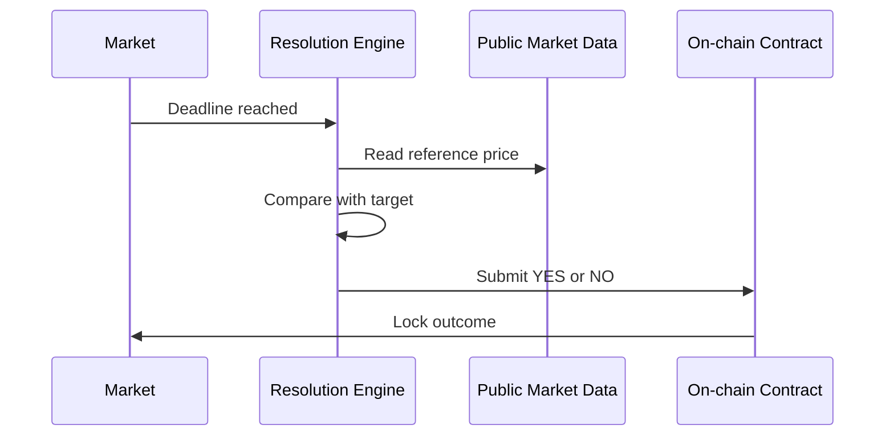

## Resolution principles

Every SolMarket market must be resolvable from public, timestamped market data. The resolution process is built around clarity, not discretion.

<CardGroup cols={2}>
  <Card title="Clear question" icon="circle-question">
    Each market defines the token, target price, direction, and deadline before trading begins.
  </Card>
  <Card title="Public reference data" icon="chart-line">
    Outcomes are checked against publicly available market data, so participants can independently verify the result.
  </Card>
  <Card title="Limited authority" icon="shield">
    The resolver can submit YES or NO. It cannot move user funds or alter payouts.
  </Card>
  <Card title="Refund fallback" icon="rotate-left">
    If a market is not resolved within its resolution window, participants can recover their funds through the refund path.
  </Card>
</CardGroup>

---

## Resolution flow

```mermaid
sequenceDiagram
    participant M as Market
    participant R as Resolution Engine
    participant D as Public Market Data
    participant C as On-chain Contract

    M->>R: Deadline reached
    R->>D: Read reference price
    R->>R: Compare with target
    R->>C: Submit YES or NO
    C->>M: Lock outcome
```

<Steps>
  <Step title="Deadline reached">
    The market stops accepting new trades when its expiry time arrives.
  </Step>
  <Step title="Reference price checked">
    The resolution engine reads the agreed market reference and compares it with the target.
  </Step>
  <Step title="Outcome submitted">
    The outcome is submitted on-chain as YES or NO.
  </Step>
  <Step title="Claims open">
    Winning users claim from the pool. If the resolution window passes without a valid outcome, refunds become available.
  </Step>
</Steps>

---

## What the resolver cannot do

| Action | Possible? |
|---|---|
| Move funds to itself | No |
| Change payout math | No |
| Edit user positions | No |
| Resolve before deadline | No |
| Choose YES or NO after deadline | Yes, within the published resolution rules |

<Note>
  The resolver is a market-outcome authority, not a funds authority. Custody and payouts remain controlled by on-chain rules.
</Note>

---

## Future direction

SolMarket's long-term direction is a more decentralized resolution layer: multiple resolvers, dispute windows for high-volume markets, and stronger public reporting around outcome decisions.
