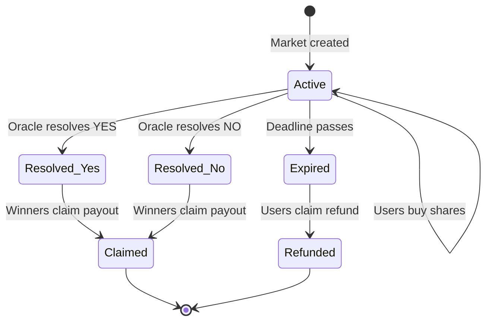

## What is a parimutuel market?

In a parimutuel system, all bets on a given event go into a **single shared pool**. When the event resolves, the pool is distributed to winners **proportionally** to the number of shares they hold.

This is fundamentally different from a traditional bookmaker (where the house takes the other side) or an order book (where you trade against specific counterparties).

<Note>
  **Key insight**: In parimutuel betting, you're not betting against the house — you're betting against other participants. SolMarket never takes the other side of your trade.
</Note>

---

## The math

### Share pricing

Each market has two sides: **Up** (Yes) and **Down** (No). The price of a share reflects the implied probability:

$$
\text{Up price} = \frac{\text{USDC on Up side}}{\text{Total USDC in pool}}
$$

$$
\text{Down price} = 1 - \text{Up price}
$$

**Example**: If \$700 is on Up and \$300 is on Down:
- Up share = 70¢ (70% implied probability)
- Down share = 30¢ (30% implied probability)

### Payout formula

When the market resolves, winning shareholders split the **entire pool**:

$$
\text{Payout per share} = \frac{\text{Total pool}}{\text{Winning shares}}
$$

**Example**: Pool = \$1,000. Up wins. There are 700 Up shares.
- Each Up share pays out: $\frac{1000}{700} = \$1.4286$
- Someone who bought 10 Up shares at 70¢ each (\$7 invested) receives \$14.29
- Net profit: **+\$7.29** (104% return)

<Tip>
  The cheaper your shares when you buy, the higher your potential return. Buying Down shares at 10¢ in a market that resolves Down gives you a 10x return.
</Tip>

---

## Market lifecycle

| State | Description |
|-------|-------------|
| **Active** | Market is open for trading. Users can buy Up or Down shares. |
| **Resolved (Yes/No)** | Oracle has set the outcome. Winners can claim. |
| **Expired** | Deadline passed without resolution. Refunds available. |
| **Refunded** | All participants received their original funds back. |
| **Claimed** | Winners have collected their payouts. |

---

## Why parimutuel?

<CardGroup cols={2}>
  <Card title="No counterparty risk" icon="shield-check">
    You're not betting against the house. The protocol doesn't profit from your losses.
  </Card>
  <Card title="Simple & transparent" icon="eye">
    The math is straightforward. You can calculate your exact payout at any time.
  </Card>
  <Card title="Natural price discovery" icon="chart-line">
    Share prices naturally reflect the crowd's probability estimate. No market makers needed.
  </Card>
  <Card title="Guaranteed liquidity" icon="water">
    Every market has a pool. No need to find a counterparty — you buy shares from the pool.
  </Card>
</CardGroup>
