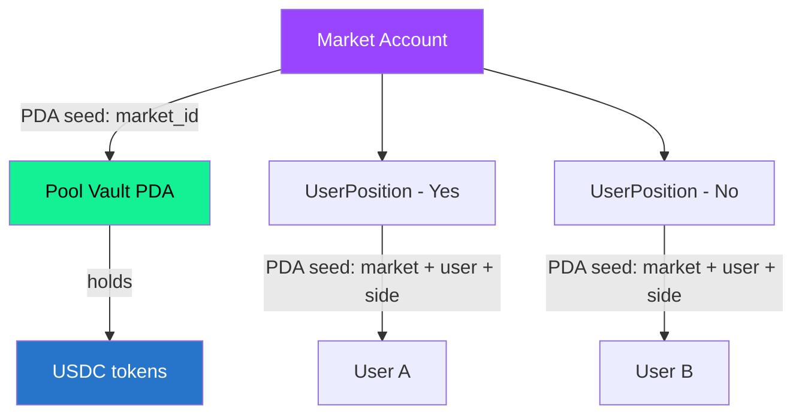

## Program overview

SolMarket's prediction market logic runs as an **Anchor program on Solana**. The program is compiled to BPF bytecode and deployed to the Solana blockchain where it executes deterministically.

<Info>
  **Program ID**: `polyXXXXXXXXXXXXXXXXXXXXXXXXXXXXXXXXXXXXXXX`<br/>
  Built with **Anchor 0.30.1** — the most widely used Solana development framework.
</Info>

---

## On-chain accounts

All state is stored in on-chain accounts derived from deterministic seeds (PDAs):



### Market Account

```rust
pub struct Market {
    pub authority: Pubkey,       // Oracle that can resolve
    pub token_mint: Pubkey,      // Memecoin being tracked
    pub usdc_mint: Pubkey,       // USDC mint
    pub pool_vault: Pubkey,      // PDA holding the USDC pool
    pub yes_tickets: u64,        // Total Up shares sold
    pub no_tickets: u64,         // Total Down shares sold
    pub yes_pool: u64,           // USDC on the Up side
    pub no_pool: u64,            // USDC on the Down side
    pub target_price: u64,       // Target price (scaled)
    pub direction: Direction,    // Above or Below
    pub status: MarketStatus,    // Active, Resolved, Refunded
    pub deadline: i64,           // Unix timestamp
    pub bump: u8,                // PDA bump
}
```

### UserPosition Account

```rust
pub struct UserPosition {
    pub market: Pubkey,          // Market this position belongs to
    pub owner: Pubkey,           // User's wallet
    pub yes_tickets: u64,        // Up shares bought
    pub no_tickets: u64,         // Down shares bought
    pub yes_paid: u64,           // USDC spent on Up
    pub no_paid: u64,            // USDC spent on Down
    pub claimed: bool,           // Whether winnings have been claimed
    pub bump: u8,
}
```

---

## Instructions

The program exposes four instructions:

### `buy_tickets`

Transfers USDC from the user's wallet to the pool PDA and records the ticket purchase.

```
✅ Anyone can call (with their own funds)
✅ Market must be Active
✅ Market deadline must not have passed
✅ Minimum 1 ticket
```

### `resolve_market`

Sets the market outcome to YES or NO. Only callable by the **designated oracle authority**.

```
🔒 Only the oracle authority can call
✅ Market must be Active
✅ Compares price vs target
```

### `claim_winnings`

Calculates the user's proportional share of the pool and transfers USDC from the pool PDA to their wallet.

```
✅ Market must be Resolved
✅ User must have winning tickets
✅ User must not have already claimed
✅ Payout = (user_winning_tickets / total_winning_tickets) × total_pool
```

### `refund`

Returns the user's original investment if the market expired without resolution.

```
✅ Market must be past deadline without resolution
✅ User must have tickets
✅ Returns exact amount originally paid
```

---

## PDA Security

All funds are held in **Program Derived Addresses** (PDAs). These are special accounts where:

<CardGroup cols={2}>
  <Card title="No private key" icon="key">
    PDAs are derived from seeds + the program ID. There is literally no private key that could sign for these accounts. Only the program's code can move funds.
  </Card>
  <Card title="Deterministic" icon="fingerprint">
    Anyone can calculate the PDA address from the seeds and verify that funds are stored there. Fully verifiable on any Solana explorer.
  </Card>
</CardGroup>

<Warning>
  **What this means**: Even if the SolMarket team's computers were compromised, an attacker could not drain the pool vaults. The funds can only move according to the program's logic (claim or refund).
</Warning>

---

## Verifying the program

Anyone can verify the deployed program:

1. **View on explorer**: Search the Program ID on [Solscan](https://solscan.io) or [Solana Explorer](https://explorer.solana.com)
2. **Check the code**: The source code will be published on GitHub
3. **Build and compare**: Compile the Anchor program locally and compare the resulting binary hash with the deployed program's hash

```bash
# Clone the repo
git clone https://github.com/solmarket/contracts
cd contracts

# Build
anchor build

# Compare hash
sha256sum target/deploy/polymeme.so
# vs the deployed program's executable data hash on-chain
```
