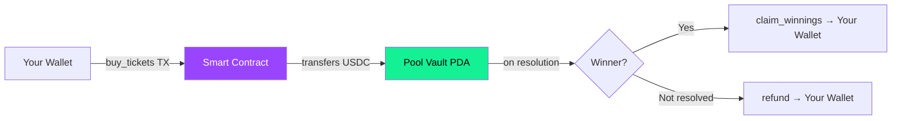

## Where are the funds?

When you buy shares on SolMarket, your USDC is transferred to a **Program Derived Address (PDA)** — a special Solana account controlled exclusively by the smart contract.



---

## What is a PDA?

A **Program Derived Address** is a Solana account address that:

1. Is **derived deterministically** from a set of seeds + the program ID
2. **Has no private key** — it lies "off the curve" of the Ed25519 elliptic curve
3. Can **only be controlled** by the program that derived it

<Warning>
  This is not a marketing claim — it's a mathematical property of elliptic curve cryptography. A PDA literally does not have a corresponding secret key in the Ed25519 key space. No one can sign transactions for it.
</Warning>

### How to verify

You can derive the PDA yourself and verify it holds the market's USDC:

```bash
# The PDA is derived from seeds like:
# ["pool", market_pubkey]
# Using the SolMarket program ID

# Check on Solana Explorer or Solscan:
# 1. Find the market account
# 2. Read the pool_vault field
# 3. Search that address on Solscan
# 4. Verify it holds the expected USDC balance
```

---

## Fund flow guarantees

### Inflow: Buying shares
```
User → signs TX → Smart Contract → USDC moves to PDA vault
```
- Only the user can initiate (requires wallet signature)
- USDC goes to the pool PDA, not any team wallet
- Transaction is recorded on Solana — immutable

### Outflow: Only two paths exist

<Tabs>
  <Tab title="Path 1: Claim winnings">
    **Conditions required:**
    - Market must be in `Resolved` state
    - User must hold winning-side shares
    - User must not have already claimed
    
    **What happens:**
    - Smart contract calculates: `(user_tickets / total_winning_tickets) × total_pool × (1 - fee)`
    - USDC transfers from PDA vault → user's wallet
    - Position marked as `claimed` (prevents double-claim)
  </Tab>
  <Tab title="Path 2: Refund">
    **Conditions required:**
    - Market deadline has passed
    - Market has NOT been resolved
    - User has tickets in this market
    
    **What happens:**
    - Smart contract returns the exact USDC the user originally paid
    - USDC transfers from PDA vault → user's wallet
    - Position marked as `claimed`
  </Tab>
</Tabs>

<Note>
  **There is no third path.** The smart contract does not contain any `withdraw`, `admin_drain`, or `emergency_transfer` instruction. The only way USDC leaves the pool is through `claim_winnings` or `refund`.
</Note>

---

## What about the team?

The SolMarket team:

- ❌ **Cannot** withdraw funds from the pool
- ❌ **Cannot** modify payout amounts
- ❌ **Cannot** change the fee after deployment
- ❌ **Cannot** prevent users from claiming
- ❌ **Cannot** prevent refunds after the deadline
- ✅ **Can** resolve markets (set YES/NO outcome via oracle)
- ✅ **Can** create new markets
- ✅ **Can** upgrade the program (with multi-sig, in the future the authority will be revoked)

---

## Rent and account costs

Solana accounts require a small SOL deposit ("rent") to exist on-chain. These costs are:

| Account | Rent cost | Who pays |
|---------|-----------|----------|
| Market account | ~0.004 SOL | Protocol (market creator) |
| User position | ~0.0016 SOL | User (included in transaction) |
| Pool vault | ~0.002 SOL | Protocol |

<Tip>
  When positions are closed, the rent is **returned** to the original payer. Solana rent is fully recoverable — it's not a fee, it's a deposit.
</Tip>
