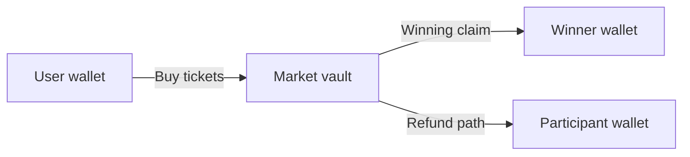

## Where funds go

When a user buys market tickets, USDC moves into that market's on-chain vault. The team does not receive the principal. The vault releases funds only through the market's claim or refund paths.

```mermaid
graph LR
    A[User wallet] -->|Buy tickets| B[Market vault]
    B -->|Winning claim| C[Winner wallet]
    B -->|Refund path| D[Participant wallet]
```

---

## Two exit paths

| Path | When it happens | Result |
|---|---|---|
| Claim | Market resolves and the user holds winning tickets | User receives their proportional share of the pool. |
| Refund | Market cannot be resolved within the allowed window | User recovers the amount paid into that market. |

There is no normal operating path where the team withdraws user principal from a market vault.

---

## Why this matters

Traditional betting platforms custody funds and decide when users can withdraw. SolMarket's design is different: funds are committed to a specific market and released according to transparent market rules.

<CardGroup cols={2}>
  <Card title="Separated pools" icon="layer-group">
    Each market has its own pool accounting, so one market cannot casually drain another.
  </Card>
  <Card title="Wallet confirmation" icon="signature">
    Users see and sign transactions from their own wallet before funds move.
  </Card>
  <Card title="Claim discipline" icon="check">
    A position can only be claimed once, which protects the pool from duplicate payouts.
  </Card>
  <Card title="Refund protection" icon="rotate-left">
    If resolution fails, participants are not dependent on a manual support process.
  </Card>
</CardGroup>

---

## Team powers and limits

| Team action | Status |
|---|---|
| Create markets | Allowed through governed operations. |
| Resolve markets | Allowed within published resolution rules. |
| Redirect user funds | Not part of normal market logic. |
| Change a user's signed trade | Not possible after confirmation. |
| Prevent a valid refund path | Not part of normal market logic. |
