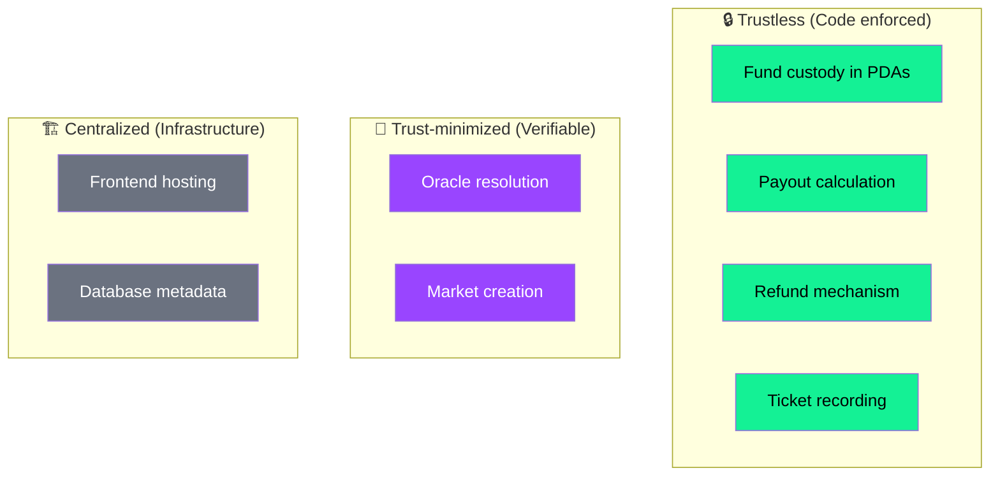

## Trust architecture

SolMarket is designed so that **you don't need to trust us with your money**. The protocol uses Solana's programmability to ensure funds are handled by code, not people.

---

## Security guarantees

### ✅ Absolute guarantees (enforced by Solana)

These are enforced by the smart contract and **cannot be bypassed** by anyone, including the SolMarket team:

<CardGroup cols={2}>
  <Card title="Funds in PDAs" icon="vault">
    All USDC is held in Program Derived Addresses. No private key exists for these accounts. Only the program logic can move funds.
  </Card>
  <Card title="Immutable payout math" icon="calculator">
    The parimutuel formula is hardcoded in Rust. Winners always receive their proportional share of the pool — no one can change the calculation.
  </Card>
  <Card title="Guaranteed refunds" icon="rotate-left">
    If a market is not resolved by its deadline, **any user can trigger a refund**. This is permissionless — you don't need the team's cooperation.
  </Card>
  <Card title="Tamper-proof records" icon="database">
    Every ticket purchase is a Solana transaction. Once confirmed, it cannot be modified or deleted by anyone.
  </Card>
</CardGroup>

### 🤝 Trust-minimized (publicly verifiable)

<CardGroup cols={2}>
  <Card title="Oracle accuracy" icon="eye">
    The oracle uses DexScreener's public API. Anyone can verify that a market was resolved correctly by checking the historical price data.
  </Card>
  <Card title="Open source" icon="code">
    The smart contract source code is published on GitHub. Anyone can compile it and compare the binary hash with the deployed program.
  </Card>
</CardGroup>

---

## Threat analysis

| Threat | Mitigation |
|--------|-----------|
| **Team tries to withdraw pool funds** | Impossible — PDAs have no private key. No `withdraw` instruction exists in the program. |
| **Team resolves market incorrectly** | Verifiable — DexScreener data is public. Community can identify and expose any incorrect resolution. |
| **Smart contract bug** | The contract is built with Anchor's safety features and has been thoroughly tested. Code is open source for community review. |
| **Frontend compromise** | The frontend only builds transactions — your wallet shows you exactly what you're signing. Always review before confirming. |
| **Database compromise** | Database only stores metadata (names, images). No funds or keys are in the database. |
| **Team disappears** | Funds remain safely in PDAs. Refund mechanism is permissionless — users can claim without any team involvement. |

---

## Comparison with traditional platforms

| Feature | Traditional betting | SolMarket |
|---------|-------------------|-----------|
| Fund custody | Company bank account | Solana PDAs (no human access) |
| Payout logic | Company decides | Smart contract (immutable code) |
| Withdrawal risk | Company can freeze/seize | Impossible — PDAs only follow program rules |
| Transparency | Opaque | Fully on-chain + open source |
| Refund if abandoned | Depends on company | Automatic, permissionless |

<Note>
  **Bottom line**: In traditional betting, you trust the company. In SolMarket, you trust math and Solana's consensus mechanism. The funds literally cannot be stolen because no private key exists for the pool accounts.
</Note>
