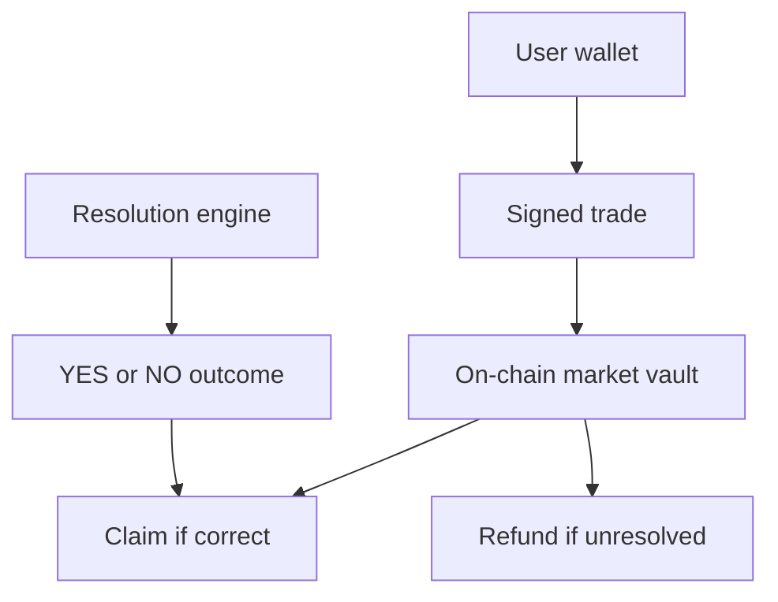

## Security model

SolMarket is designed so users do not need to trust the team with custody of their money. Users sign their own trades, market funds sit in on-chain vaults, and payouts follow fixed market rules.

```mermaid
graph TD
    A[User wallet] --> B[Signed trade]
    B --> C[On-chain market vault]
    C --> D[Claim if correct]
    C --> E[Refund if unresolved]
    F[Resolution engine] --> G[YES or NO outcome]
    G --> D
```

---

## What is protected by code

<CardGroup cols={2}>
  <Card title="No team custody" icon="vault">
    User funds sit in market vaults controlled by program rules, not by a team wallet.
  </Card>
  <Card title="Fixed payout logic" icon="calculator">
    Winners receive their proportional share of the pool. The result is based on tickets, not manual discretion.
  </Card>
  <Card title="Refund fallback" icon="rotate-left">
    If a market is not resolved within its window, participants can recover their funds through the refund path.
  </Card>
  <Card title="User-signed actions" icon="signature">
    A trade cannot happen unless the user's wallet signs it.
  </Card>
</CardGroup>

---

## What remains trust-minimized

Market resolution requires an outcome authority. That authority can submit YES or NO after the market deadline, but it cannot redirect funds, rewrite positions, or change payout math.

| Component | Trust level | Why |
|---|---|---|
| User custody | Trustless | Only the user signs wallet actions. |
| Market vault | Code-enforced | Funds move only through claim or refund paths. |
| Payout formula | Code-enforced | Proportional payout rules are fixed. |
| Resolution | Trust-minimized | Outcome is submitted by a resolver and should be publicly auditable. |
| Market creation | Governed | Admins and qualified holders can shape what gets listed. |

---

## Practical guarantees

| Concern | Protection |
|---|---|
| Team withdraws pool funds | Not possible through normal market rules. |
| User wins but team refuses payout | Winners can claim from the market vault after resolution. |
| Market is abandoned | Refund path protects participants after the resolution window. |
| Frontend displays wrong information | Wallet confirmation and on-chain records remain the source of truth. |
| Outcome dispute | Market terms and reference data should be public enough for independent review. |

<Note>
  The goal is not to hide trust assumptions. The goal is to minimize them and make the remaining ones easy to audit.
</Note>
