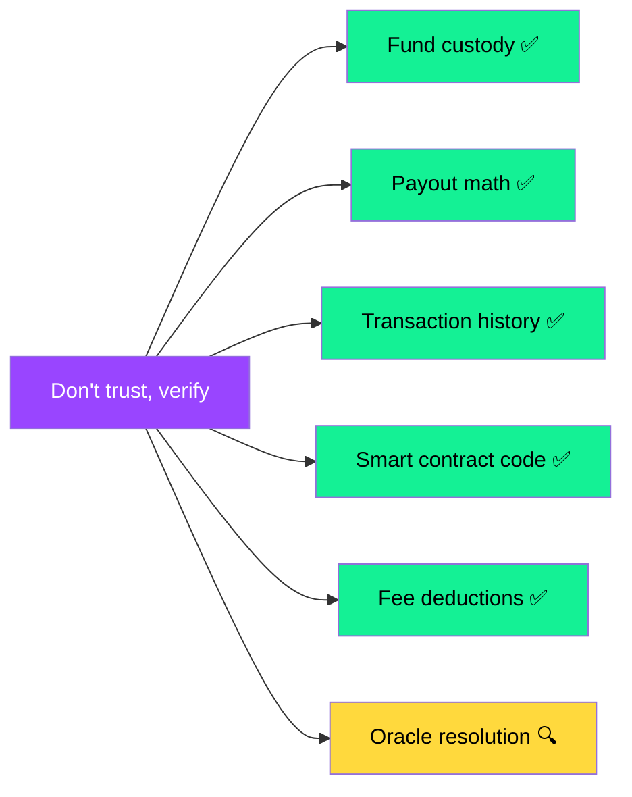

## Fully on-chain, fully verifiable

Every operation on SolMarket leaves a permanent trace on the Solana blockchain. Here's how to independently verify every aspect of the protocol.

---

## 1. Verify fund custody

<Steps>
  <Step title="Find the market on SolMarket">
    Open any market on solmarket.app and note the market ID.
  </Step>
  <Step title="Look up the market account">
    Search the market's on-chain account on [Solscan](https://solscan.io) or [Solana Explorer](https://explorer.solana.com). The `pool_vault` field shows the PDA holding the funds.
  </Step>
  <Step title="Check the PDA balance">
    Search the pool vault address. You'll see the USDC balance matches the total pool amount shown in the UI.
  </Step>
  <Step title="Verify it's a PDA">
    The vault address has no corresponding private key. It's derived from `["pool", market_pubkey]` + the program ID. You can compute this yourself.
  </Step>
</Steps>

---

## 2. Verify market resolution

Every resolution is a Solana transaction with full details:

| Data point | Where to find it |
|-----------|-----------------|
| Resolution transaction | Search the market account on Solscan → "Transactions" tab |
| Price at resolution time | [DexScreener](https://dexscreener.com) historical chart for the token |
| Target price | Market account's `target_price` field |
| Direction | Market account's `direction` field |
| Outcome | Market account's `status` field (resolved_yes / resolved_no) |

<Tip>
  If you believe a market was resolved incorrectly, compare the DexScreener price at the deadline timestamp with the market's target price and direction. All data is public.
</Tip>

---

## 3. Verify payout calculations

For any winning claim, you can verify the math:

```
Your payout = (your_winning_tickets / total_winning_tickets) × total_pool × (1 - 0.01)
```

All values are available on-chain:
- `your_winning_tickets` → Your UserPosition account
- `total_winning_tickets` → Market account (`yes_tickets` or `no_tickets`)
- `total_pool` → Pool vault USDC balance (or `yes_pool + no_pool`)
- `0.01` → Hardcoded fee (FEE_BPS = 100)

---

## 4. Verify the smart contract code

<AccordionGroup>
  <Accordion title="View the source code" icon="code">
    The smart contract source code is published on GitHub. You can read every line of the program that handles your funds.
  </Accordion>
  
  <Accordion title="Build and compare" icon="hammer">
    For maximum trust, you can:
    1. Clone the repository
    2. Build exactly the same binary (`anchor build`)
    3. Compare the SHA-256 hash of your build with the deployed program's executable data
    
    If the hashes match, the deployed program is provably the same as the published source code.
  </Accordion>
  
  <Accordion title="Check the IDL" icon="file-lines">
    The Interface Description Language (IDL) shows every instruction, account, and type in the program. You can verify that:
    - There is **no** `withdraw` or `drain` instruction
    - Only `buy_tickets`, `resolve_market`, `claim_winnings`, and `refund` exist
    - The authority constraints match what's documented
  </Accordion>
</AccordionGroup>

---

## 5. Verify fee usage

Protocol fees (1% on winning claims) are sent to a known fee wallet. You can:

1. Track the fee wallet on Solscan
2. Monitor $SOLMARKET buyback transactions on Meteora/Raydium
3. Verify burn transactions on-chain (tokens sent to burn address)

The buyback & burn wallet will be published and all transactions will be independently verifiable.

---

## Summary: Trust spectrum



<Note>
  **Everything except oracle resolution is cryptographically verifiable.** Oracle resolution is publicly auditable — you can check it against DexScreener data. The green items require zero trust. The yellow item requires minimal trust (public verifiability).
</Note>
