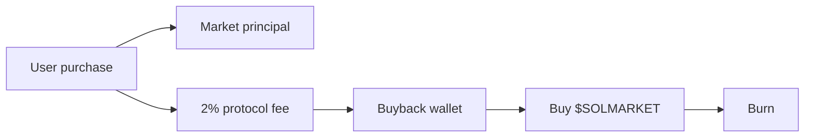

## Public verification

SolMarket should be understandable without exposing internal infrastructure. Users only need to verify the things that affect their money: market terms, transactions, outcomes, fees, and burns.

---

## What to verify

| Item | What users can check |
|---|---|
| Market terms | Token, target, direction, and deadline before trading. |
| User trade | Wallet-signed transaction and received ticket position. |
| Market pool | USDC entering the market vault. |
| Resolution | YES or NO outcome submitted after the deadline. |
| Payout | Claim amount compared with winning tickets and total pool. |
| Buyback and burn | Fee wallet inflows, buy transactions, and burn transactions. |

---

## Fee transparency

Prediction-market fees are simple: a 2% purchase fee funds the buyback and burn wallet. The principal stays in the market pool.

```mermaid
graph LR
    A[User purchase] --> B[Market principal]
    A --> C[2% protocol fee]
    C --> D[Buyback wallet]
    D --> E[Buy $SOLMARKET]
    E --> F[Burn]
```

---

## Outcome transparency

Every market should be judged against its published terms. The token, target, direction, and deadline are known before users trade. The final outcome can be reviewed against public market data.

<Tip>
  The professional standard is not to expose every internal system. It is to make every user-impacting decision auditable.
</Tip>

---

## Public reporting roadmap

SolMarket should surface a clean public dashboard with:

| Metric | Why it matters |
|---|---|
| Markets created | Shows product activity. |
| Seed deployed | Shows capital working. |
| Seed recovered | Shows treasury discipline. |
| Buyback pending | Shows fee accumulation. |
| Tokens burned | Shows deflation. |
| Holder proposals reviewed | Shows community involvement. |
