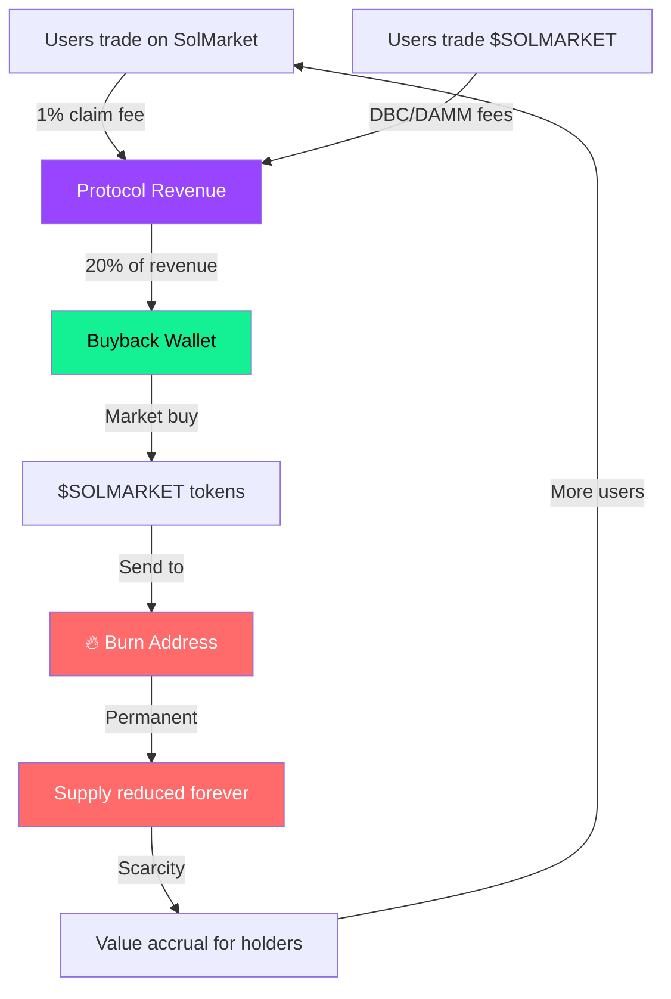

## The deflationary flywheel

SolMarket generates revenue from two sources. A portion of all revenue is used to **buy $SOLMARKET tokens from the open market** and **burn them permanently**, reducing the total supply forever.



---

## Revenue sources

### Source 1: Prediction market fees

Every winning claim on SolMarket has a **1% protocol fee**. From this:

| Use | Share | Example ($100 payout) |
|-----|-------|-----------------------|
| Team & operations | 80% | $0.80 |
| **Buyback & burn** | **20%** | **$0.20** |

### Source 2: Token trading fees

$SOLMARKET trading on Meteora generates fees:

**DBC phase (2.5% fee):**

| Use | Amount per $100 trade |
|-----|----------------------|
| Team & operations (90% of creator share) | $1.80 |
| **Buyback & burn (10% of creator share)** | **$0.20** |
| Meteora protocol | $0.50 |

**DAMM v2 phase (1.5% fee):**

| Use | Amount per $100 trade |
|-----|----------------------|
| LP rewards + Team | Variable |
| **Buyback & burn** | **Ongoing** |

---

## How buyback & burn works

<Steps>
  <Step title="Revenue accumulates">
    Protocol fees from prediction markets and token trading fees accumulate in the revenue wallet.
  </Step>
  <Step title="Buyback execution">
    At regular intervals, the protocol uses the accumulated USDC/SOL to **market-buy $SOLMARKET** from the Meteora pool.
  </Step>
  <Step title="Permanent burn">
    Purchased tokens are sent to the **Solana burn address** — a known address with no private key. These tokens are irreversibly destroyed.
    ```
    Burn address: 1nc1nerator11111111111111111111111111111111
    ```
  </Step>
  <Step title="Supply decreases">
    The total circulating supply of $SOLMARKET permanently decreases. This is verifiable on-chain by anyone.
  </Step>
</Steps>

---

## Impact modeling

Here's how the buyback & burn scales with protocol volume:

| Monthly prediction volume | Protocol fees (1%) | Buyback amount (20%) | Annual burn |
|--------------------------|-------------------|--------------------|-------------|
| $100,000 | $1,000 | $200 | $2,400 |
| $500,000 | $5,000 | $1,000 | $12,000 |
| $1,000,000 | $10,000 | $2,000 | $24,000 |
| $5,000,000 | $50,000 | $10,000 | $120,000 |

<Note>
  These figures only include prediction market fees. Token trading fees on Meteora provide **additional** buyback revenue on top of this. The actual burn rate will be higher.
</Note>

---

## Transparency & verification

Every buyback and burn transaction is executed on-chain. You can verify:

<CardGroup cols={2}>
  <Card title="Buyback wallet" icon="wallet">
    The wallet that receives protocol revenue and executes buybacks will be published. All inflows and outflows are on-chain.
  </Card>
  <Card title="Burn transactions" icon="fire">
    Every burn is a token transfer to the burn address. Search the burn address on Solscan to see all burned tokens and timestamps.
  </Card>
  <Card title="Circulating supply" icon="chart-line">
    `Current supply = Initial supply - Total burned`. Both values are verifiable on-chain at any time.
  </Card>
  <Card title="Revenue tracking" icon="receipt">
    Protocol fee transactions on the smart contract are all public. You can audit exactly how much revenue generates how much burn.
  </Card>
</CardGroup>

---

## Comparison with other mechanisms

| Mechanism | Effect | SolMarket |
|-----------|--------|-----------|
| Buyback & burn | Deflationary, revenue-backed | ✅ Active |
| Staking rewards | Inflationary, dilutive | ❌ Not used |
| Emission farming | Highly inflationary | ❌ Not used |
| Revenue sharing | Non-dilutive | 🔜 Planned |

<Tip>
  Unlike staking emissions that inflate supply, **buyback & burn is inherently deflationary**. Every token burned is gone forever. The mechanism is funded by real protocol revenue — not by printing new tokens.
</Tip>
