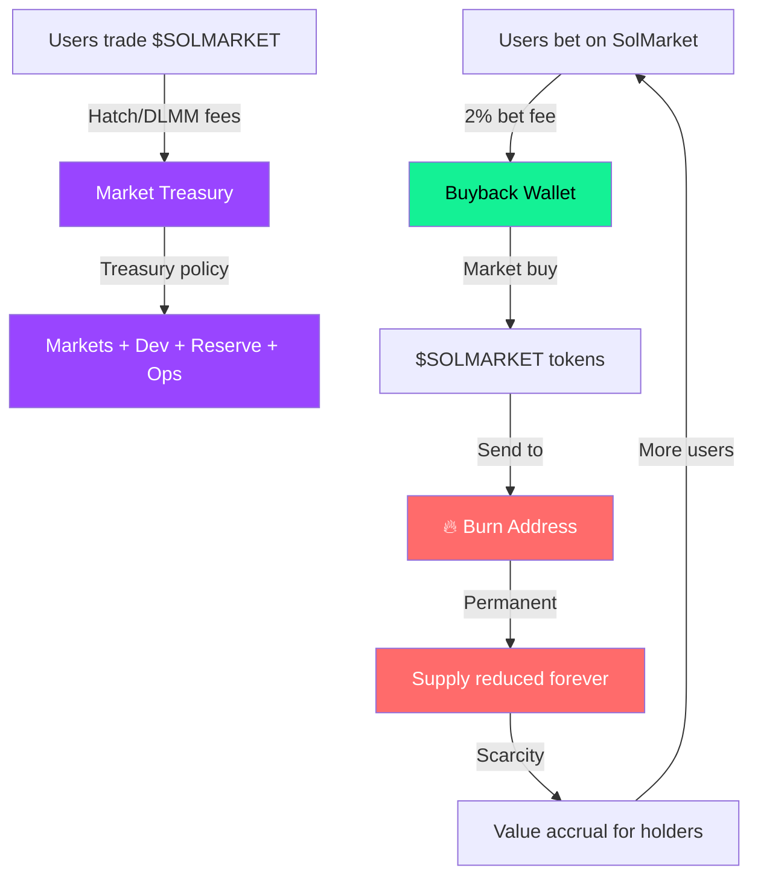

## The deflationary flywheel

SolMarket prediction-market fees are routed to a dedicated buyback wallet. Those funds are used to **buy $SOLMARKET tokens from the open market** and **burn them permanently**, reducing the total supply forever.


```mermaid
graph TD
    A[Users bet on SolMarket] -->|2% bet fee| D[Buyback Wallet]
    C[Users trade $SOLMARKET] -->|Hatch/DLMM fees| T[Market Treasury]
    T -->|Treasury policy| M[Markets + Dev + Reserve + Ops]
    D -->|Market buy| E[$SOLMARKET tokens]
    E -->|Send to| F[🔥 Burn Address]
    F -->|Permanent| G[Supply reduced forever]
    G -->|Scarcity| H[Value accrual for holders]
    H -->|More users| A
    style T fill:#9945FF,color:#fff
    style M fill:#9945FF,color:#fff
    style D fill:#14F195,color:#000
    style F fill:#FF6B6B,color:#fff
    style G fill:#FF6B6B,color:#fff
```

---

## Revenue sources

### Source 1: Prediction market bet fees

Every bet purchase includes a **2% protocol fee** routed to `BET_FEE_WALLET`.

| Use | Share | Example ($100 bet) |
|-----|-------|-----------------------|
| **Buyback & burn** | **100% of prediction-market fees** | **$2.00** |

### Source 2: Hatch Dev Mode token trading fees

$SOLMARKET trading through Hatch Dev Mode has two fee paths:

- **100% of SOL-side fees** accrue to the launcher/dev wallet, then flow into the Hatch Claim Bot and treasury policy.
- **100% of token-side fees** are burnt at the AMM level automatically.

SOL-side fees are not automatically all spent on buybacks. They fund the operating treasury first.

Default treasury allocation:

| Use | Share |
|-----|-------|
| Market reinvestment | 15% |
| Developer/profit | 55% |
| Reserve | 20% |
| Operations | 10% |

See [Treasury & Market Bots](/protocol/treasury-bots) for the spend caps and market seed policy.

---

## How buyback & burn works

<Steps>
  <Step title="Revenue accumulates">
    Prediction-market fees accumulate in `BET_FEE_WALLET`. Token-trading SOL fees accumulate in the market treasury via the [Hatch Claim Bot](/protocol/bot-architecture#hatch-claim-bot).
  </Step>
  <Step title="Wait for the $10 floor">
    The buyback bot polls the fee wallet every 10 minutes. Production execution should only start once the accumulated balance crosses **`BUYBACK_MIN_USDC=10`**. Below the floor, the cycle is skipped to avoid wasting gas on dust.
  </Step>
  <Step title="Buyback execution">
    Once the floor is crossed, the bot uses the accumulated USDC/SOL to **market-buy $SOLMARKET** from the Hatch pool.
  </Step>
  <Step title="Permanent burn">
    Purchased tokens are sent to the **Solana burn address** — a known address with no private key. These tokens are irreversibly destroyed.
    ```
    Burn address: 1nc1nerator11111111111111111111111111111111
    ```
  </Step>
  <Step title="Supply decreases">
    The total circulating supply of $SOLMARKET permanently decreases. This is verifiable on-chain by anyone.
  </Step>
</Steps>

<Note>
  In addition to this bot-driven buyback, the Hatch Dev-Mode pool **burns 100% of token-side fees automatically on every swap**. That happens at the AMM level — no bot, no human signer. See [Hatch Launch & Dev Mode](/protocol/hatch-launch).
</Note>

<Warning>
  Current implementation state: the backend buyback monitor records threshold events. Live swap-and-burn execution must remain disabled until the Hatch route adapter is tested and the production floor is set to `BUYBACK_MIN_USDC=10`.
</Warning>

---

## Impact modeling

Here's how the buyback & burn scales with prediction-market volume:

| Monthly prediction volume | Bet fees (2%) | Buyback amount | Annual burn |
|--------------------------|-------------------|--------------------|-------------|
| $100,000 | $2,000 | $2,000 | $24,000 |
| $500,000 | $10,000 | $10,000 | $120,000 |
| $1,000,000 | $20,000 | $20,000 | $240,000 |
| $5,000,000 | $100,000 | $100,000 | $1,200,000 |

<Note>
  These figures only include prediction-market bet fees. Token trading fees primarily fund the market treasury, developer/profit allocation, reserve, and operations.
</Note>

---

## Transparency & verification

When live execution is enabled, every buyback and burn transaction is executed on-chain. You can verify:

<CardGroup cols={2}>
  <Card title="Buyback wallet" icon="wallet">
    The wallet that receives protocol revenue will be published. All inflows are on-chain, and outflows become verifiable once live execution is enabled.
  </Card>
  <Card title="Burn transactions" icon="fire">
    Every burn is a token transfer to the burn address. Search the burn address on Solscan to see all burned tokens and timestamps.
  </Card>
  <Card title="Circulating supply" icon="chart-line">
    `Current supply = Initial supply - Total burned`. Both values are verifiable on-chain at any time.
  </Card>
  <Card title="Revenue tracking" icon="receipt">
    Protocol fee transactions on the smart contract are all public. You can audit exactly how much revenue generates how much burn.
  </Card>
</CardGroup>

---

## Comparison with other mechanisms

| Mechanism | Effect | SolMarket |
|-----------|--------|-----------|
| Buyback & burn | Deflationary, revenue-backed | Monitor active; execution gated |
| Staking rewards | Inflationary, dilutive | ❌ Not used |
| Emission farming | Highly inflationary | ❌ Not used |
| Revenue sharing | Non-dilutive | 🔜 Planned |

<Tip>
  Unlike staking emissions that inflate supply, **buyback & burn is inherently deflationary**. Every token burned is gone forever. The mechanism is funded by real protocol revenue — not by printing new tokens.
</Tip>
