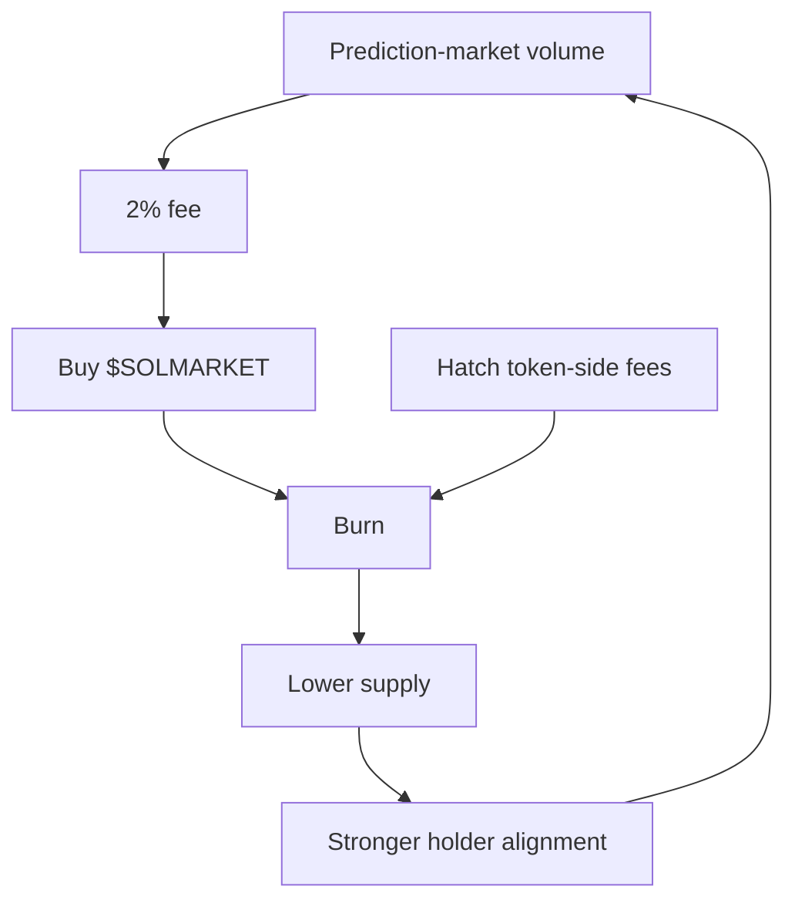

## The flywheel

Prediction-market fees fund $SOLMARKET buybacks. Bought tokens are burned, permanently reducing circulating supply. Hatch Dev Mode adds a second burn path by burning token-side trading fees automatically.

```mermaid
graph TD
    A[Prediction-market volume] --> B[2% fee]
    B --> C[Buy $SOLMARKET]
    C --> D[Burn]
    E[Hatch token-side fees] --> D
    D --> F[Lower supply]
    F --> G[Stronger holder alignment]
    G --> A
```

---

## Revenue sources

| Source | What happens |
|---|---|
| Prediction-market fees | Accumulate in the buyback wallet and fund market buys. |
| Hatch SOL-side fees | Flow to treasury policy for reserves, operations, and market growth. |
| Hatch token-side fees | Burn automatically through Dev Mode. |

---

## Buyback policy

| Rule | Reason |
|---|---|
| Wait for at least $10 | Avoids dust-sized burns and makes activity visible. |
| Buy from the open market | Creates real demand instead of accounting-only burns. |
| Burn permanently | Reduces circulating supply. |
| Publish burn activity | Lets users verify the flywheel. |

---

## Example impact

| Monthly market volume | 2% fee generated | Buyback budget |
|---|---:|---:|
| $100,000 | $2,000 | $2,000 |
| $500,000 | $10,000 | $10,000 |
| $1,000,000 | $20,000 | $20,000 |
| $5,000,000 | $100,000 | $100,000 |

<Note>
  These examples only model prediction-market fees. Hatch token-side fee burns are additional and happen at the trading-pool level.
</Note>

---

## What users should see

The public dashboard should make the burn loop visible:

| Metric | Why it matters |
|---|---|
| Buyback balance | Shows fees accumulating. |
| Last buyback | Shows execution. |
| Total burned | Shows supply reduction. |
| Market volume | Shows what funds the loop. |
| Burn history | Makes the process auditable. |
