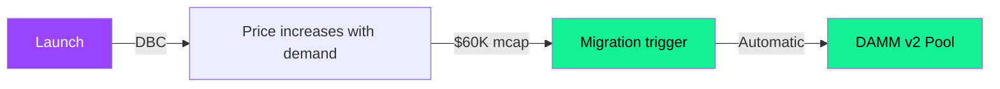
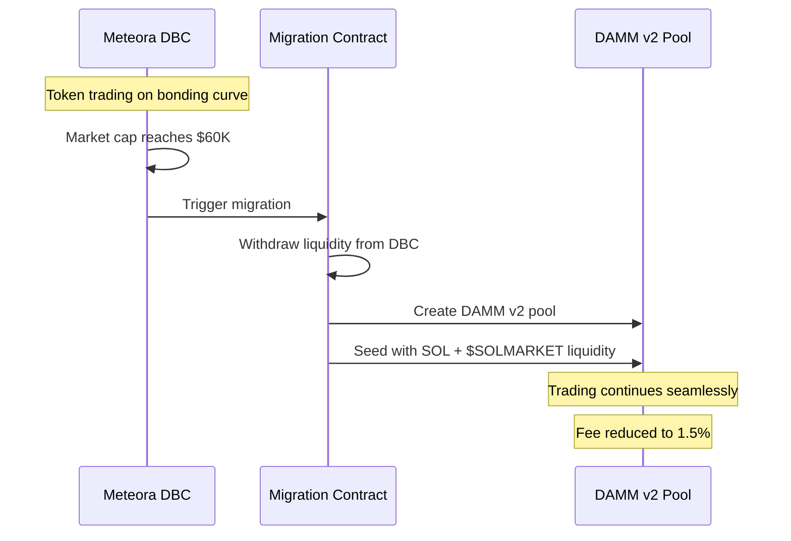

## Launch strategy

$SOLMARKET launches through **Meteora**, Solana's leading liquidity infrastructure. The launch follows a two-phase approach: start on DBC (Dynamic Bonding Curve) for initial price discovery, then migrate to DAMM v2 for long-term trading.

---

## Phase 1: Dynamic Bonding Curve (DBC)

The token launches on Meteora's **Dynamic Bonding Curve** — an automated price discovery mechanism that starts at a low price and increases as people buy.

### DBC parameters

| Parameter | Value |
|-----------|-------|
| **Trading fee** | 2.5% |
| **Fee split** | 80% to creator / 20% to protocol |
| **Migration threshold** | $60,000 market cap |
| **Config key** | `TBA — will be published at launch` |

### Fee breakdown during DBC

From the **2.5% trading fee**:

| Recipient | Share | Amount (per $100 trade) |
|-----------|-------|------------------------|
| **Creator (SolMarket team)** | 80% of 2.5% | $2.00 |
| **Meteora protocol** | 20% of 2.5% | $0.50 |

From the creator's 80% share:
| Use | Amount |
|-----|--------|
| **Team operations & development** | $1.80 (90% of $2.00) |
| **$SOLMARKET buyback & burn** | $0.20 (10% of $2.00) |

<Note>
  Even during the DBC phase, **a portion of every trade contributes to buying back and burning $SOLMARKET tokens**. The deflationary mechanism starts from day 1.
</Note>

---

## Phase 2: DAMM v2 Migration

When the token reaches **$60,000 market cap**, it automatically migrates from the DBC to Meteora's **DAMM v2** (Dynamic AMM v2) — a full-featured liquidity pool optimized for long-term trading.

### DAMM v2 parameters

| Parameter | Value |
|-----------|-------|
| **Trading fee** | 1.5% (reduced from 2.5%) |
| **Pool type** | Concentrated liquidity (DAMM v2) |
| **Migration** | Automatic at $60K mcap |

### Why the fee drops

| Phase | Fee | Reason |
|-------|-----|--------|
| **DBC (Phase 1)** | 2.5% | Higher fees during price discovery discourage bot sniping and early flipping. More revenue to bootstrap the protocol. |
| **DAMM v2 (Phase 2)** | 1.5% | Lower fees for the long-term trading phase to encourage volume and liquidity. |

---

## Migration flow

### What happens to your tokens?

<Warning>
  **Nothing changes for holders.** The migration only affects the liquidity pool. Your $SOLMARKET tokens in your wallet are unaffected. You can continue trading normally — the pool just becomes more efficient with lower fees.
</Warning>

---

## Key addresses (to be filled at launch)

| Address | Value |
|---------|-------|
| **$SOLMARKET mint** | `TBA` |
| **Meteora DBC config key** | `TBA` |
| **DAMM v2 pool address** | `TBA (created at migration)` |
| **Buyback wallet** | `TBA` |
| **Burn address** | `1nc1nerator11111111111111111111111111111111` |

<Tip>
  All addresses will be published here and on our Twitter before launch. Bookmark this page.
</Tip>
