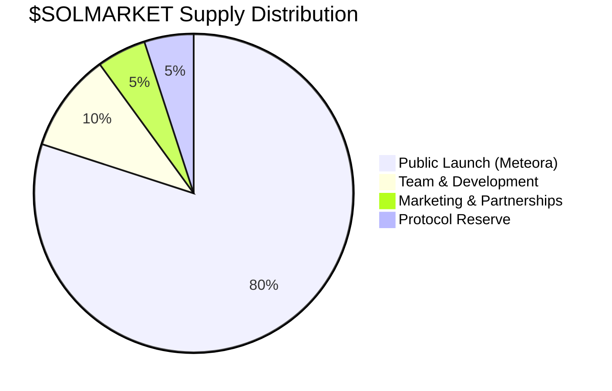
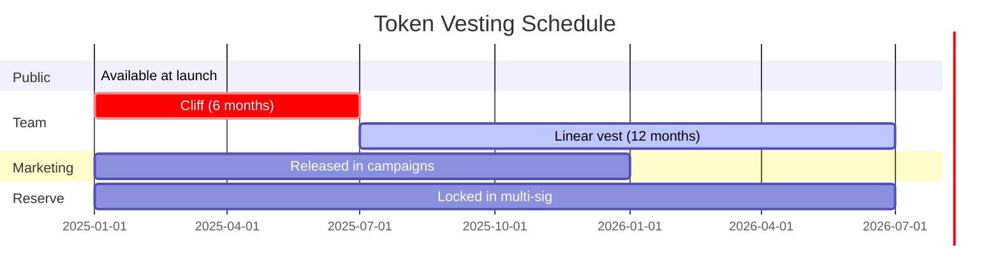

## Supply distribution

<Info>
  Final tokenomics will be published before launch. The structure below represents the planned allocation.
</Info>

| Allocation | Percentage | Details |
|-----------|------------|---------|
| **Public launch (Meteora DBC)** | 80% | Available from day 1 on the bonding curve. Fair launch — no presale, no VC allocation. |
| **Team & Development** | 10% | 6-month cliff, 12-month linear vest. Funds protocol development. |
| **Marketing & Partnerships** | 5% | Community campaigns, influencer partnerships, ecosystem integrations. |
| **Protocol Reserve** | 5% | Emergency fund, future liquidity, ecosystem grants. Locked in multi-sig. |

---

## Key principles

### Fair launch
- **No presale** — Everyone buys on the same curve
- **No VC rounds** — No private investors with discounted tokens
- **No airdrop farming** — Clean launch with organic demand

### Deflationary mechanics
- **Buyback & burn** from protocol revenue (see [Buyback & Burn](/token/buyback-burn))
- **No minting function** — Total supply is fixed at launch
- **Supply only decreases** over time as tokens are burned

---

## Vesting schedule

<Note>
  Team tokens are locked for **6 months** before any tokens vest, then vest linearly over **12 months**. This means the team can't dump tokens — their incentives are aligned with long-term protocol success.
</Note>

---

## Anti-dump protections

| Protection | How it works |
|-----------|-------------|
| **Team vesting** | 6-month cliff + 12-month vest — team can't sell early |
| **Buyback demand** | Protocol revenue continuously buys $SOLMARKET from the market |
| **Burn mechanism** | Bought tokens are burned, not re-sold — permanent supply reduction |
| **Migration fee structure** | Higher fees on DBC (2.5%) discourage early flip trading |
